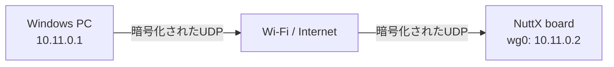
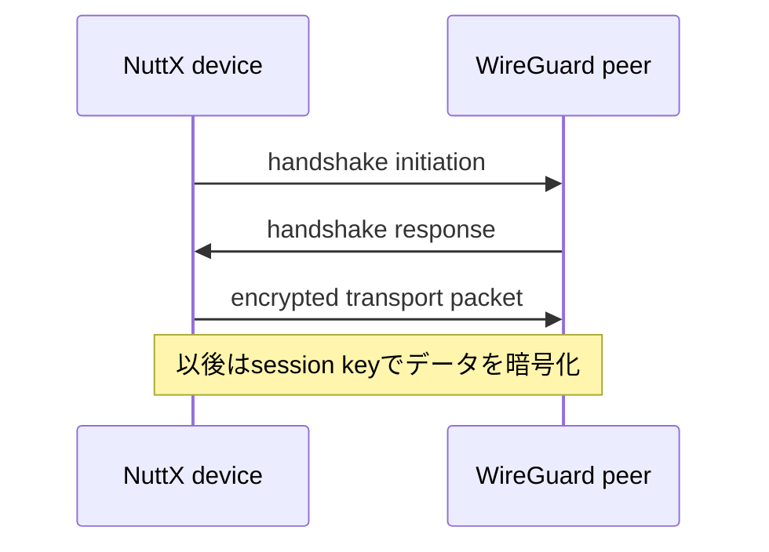
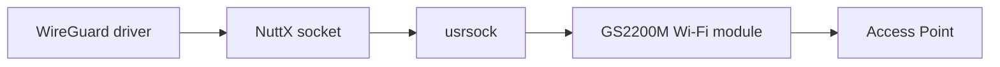
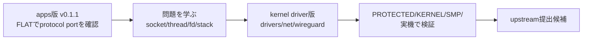
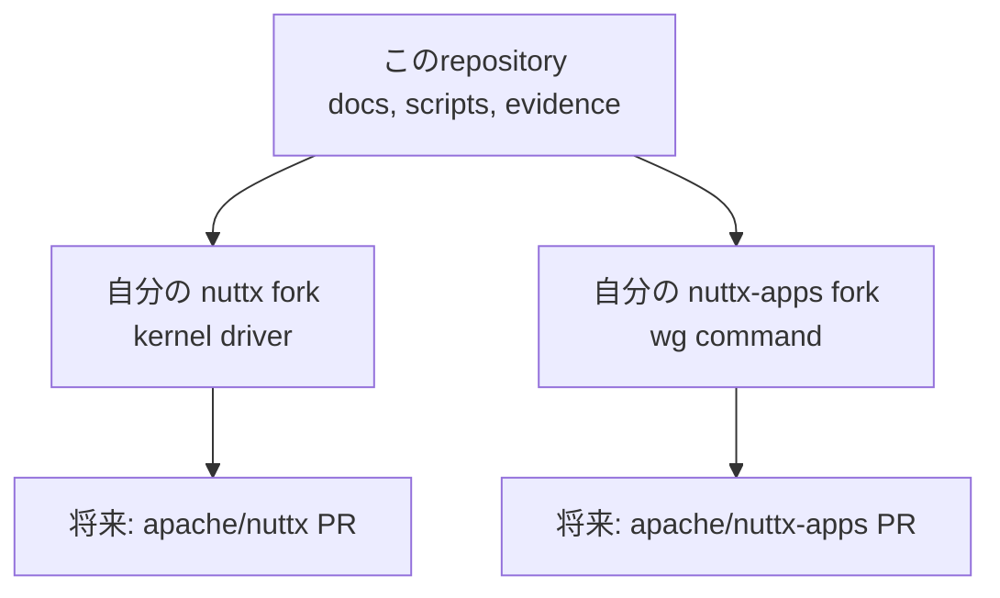
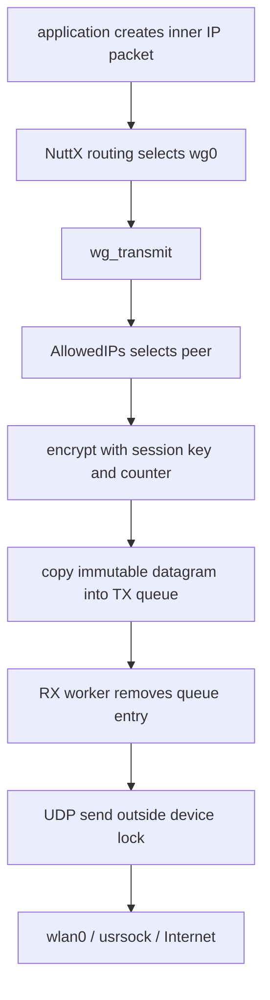
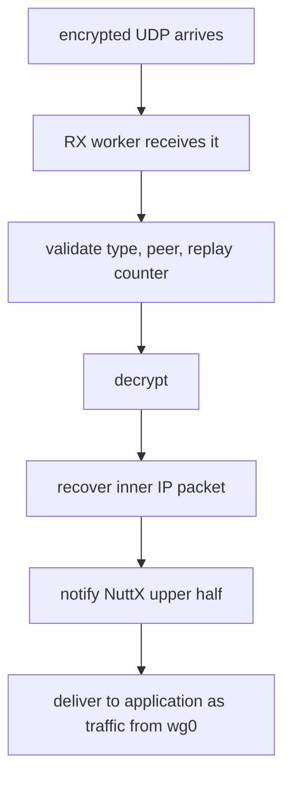

# はじめて理解する WireGuard for Apache NuttX

Community Over Code Glasgow の発表を、自分の言葉で説明するための日本語学習ガイド。
対象は「大学1年生程度のプログラミング経験はあるが、OS・ネットワーク・暗号・組込みの
専門知識はまだない」人です。

この文書の目的は、発表原稿を暗記することではありません。次の3つを理解することです。

1. 何を作ったのか
2. なぜ難しかったのか
3. 何を確認できて、何がまだ未解決なのか

実装と試験結果の正本は、[現行設計](../upstream/in-kernel-design.md)と
[検証マトリクス](../upstream/verification-matrix.md)です。この文書は、それらを読む前の
「やさしい地図」です。

---

## 0. 最初にこれだけ

### 30秒で説明すると

小さな組込み機器向けOSである **Apache NuttX** に、**WireGuardというVPN**を追加しました。
NuttX上に`wg0`という仮想ネットワーク機器を作り、そこへ届いたIPパケットを暗号化して、
普通のWi-FiからUDPパケットとして送ります。

```text
通常の通信
  アプリ → IPパケット → Wi-Fi → インターネット

今回の通信
  アプリ → IPパケット → wg0で暗号化 → UDP → Wi-Fi → インターネット
                                      ↓
                                相手が復号する
```

ESP32-S3とSPRESENSEの実機で、LinuxおよびWindowsの公式WireGuard実装との通信を確認しました。
さらに、単にpingが通るだけでは見つからない、並行処理、鍵、時刻、メモリ、再起動の問題まで
調べました。

### この発表の中心メッセージ

> **浅い試験は通る。深い試験で壊れる。**

ハンドシェイクやpingが成功しても、安全で、長く動き、停止でき、再起動後も復帰できるとは
限りません。このプロジェクトでは「動いた」の先を調べたことで、本当の問題が見つかりました。

---

## 1. どこまで知っていればよいか

### 発表前に必ず理解したいこと

| 分野 | 理解する内容 | 数式は必要か |
|---|---|---:|
| ネットワーク | IPアドレス、ポート、TCP、UDP、ルーター、NAT | 不要 |
| VPN | 元のIPパケットを暗号化し、別のパケットで運ぶ | 不要 |
| WireGuard | peer、公開鍵、秘密鍵、handshake、session key、counter | 不要 |
| OS | application、kernel、driver、threadの違い | 不要 |
| NuttX | RTOS、netdev、IOB、usrsock、FLAT/KERNEL/PROTECTED | 不要 |
| 並行処理 | lock、queue、semaphore、所有権 | 不要 |
| 検証 | PASSが何を証明し、何を証明しないか | 不要 |
| 時刻問題 | 再起動で時計が戻ると古いhandshakeとして拒否される | 不要 |

### 知らなくても発表できること

- ChaCha20やCurve25519の数式
- Noise Protocol Frameworkの証明
- NuttX schedulerの実装詳細
- TCP/IPの全ヘッダー形式
- Linuxカーネルの内部構造
- WireGuardプロトコルの全状態遷移

これらを質問された場合は、「使用した方式」「今回確認した性質」「確認していない範囲」を
答えれば十分です。暗号アルゴリズムを自作したわけではありません。

---

## 2. ネットワークの基礎

### 2.1 IPアドレスは機器の住所

IPアドレスは、ネットワーク上の機器やインターフェースを識別する番号です。

```text
PC                 Wi-Fiルーター              組込みボード
192.168.0.10  ───  192.168.0.1  ───────────  192.168.0.115
```

今回のデモでは、物理Wi-Fi用のアドレスとは別に、VPN内のアドレスを持ちます。

```text
物理ネットワーク:  wlan0 = 192.168.0.115
VPN内のネットワーク: wg0 = 10.11.0.2
```

`wlan0`は現実のWi-Fi装置、`wg0`はソフトウェアで作った仮想装置です。

### 2.2 ポート番号は建物の受付番号

1台の機器では、Webサーバー、SSH、DNSなど複数の通信が動きます。IPアドレスが建物の住所なら、
ポート番号は「どの窓口に届けるか」を示す番号です。

```text
192.168.0.115:80     → Webサーバー
192.168.0.115:51820  → WireGuard
```

### 2.3 パケットは小分けにした通信データ

ネットワークでは、大きなデータを小さな単位に分けて送ります。この単位を**パケット**と呼びます。
パケットには、宛先、送信元、種類、本文などが入ります。

### 2.4 TCPとUDP

| | TCP | UDP |
|---|---|---|
| 考え方 | 接続を作り、順序と再送を管理 | 小さなメッセージをそのまま送る |
| 信頼性 | 欠落時に再送する | 基本的に再送しない |
| 順序 | 保証する | 保証しない |
| 例 | Web、SSH、ファイル転送 | DNS、映像、ゲーム、VPNの外側 |
| WireGuardとの関係 | VPNの中をTCPが通ることがある | WireGuard自身はUDPで運ばれる |

重要なのは、**WireGuardはTCPの代わりではない**ことです。TCPやUDPを含む元のIPパケット全体を、
WireGuardが暗号化してUDPで運びます。

### 2.5 socketとは

アプリケーションがネットワークを使うための入口です。

```c
socket();       // 通信用の入口を作る
bind();         // 自分のアドレス・ポートに結び付ける
sendto();       // 送る
recvfrom();     // 受け取る
```

**BSD socket API**は、多くのUnix系OSで使われる共通の形です。NuttXもこの形を持つため、
既存のネットワークソフトを移植しやすいことが、今回の重要な背景です。

### 2.6 NATとは

家庭や会社のWi-Fiでは、複数の端末が1つのグローバルIPアドレスを共有することが一般的です。
この変換をNATと呼びます。

```text
インターネット
     │ グローバルIPは1つ
 [ Wi-Fiルーター / NAT ]
     ├── PC       192.168.0.10
     ├── phone    192.168.0.20
     └── NuttX    192.168.0.115
```

外から突然`192.168.0.115`へ接続することは通常できません。そこで、内側の機器からVPNサーバーへ
接続し、安全な経路を作る方法が役立ちます。

### 2.7 subnet、CIDR、routing

IPアドレスを1台ずつではなく範囲で表す書き方がCIDRです。

```text
10.11.0.0/24
```

`/24`は先頭24 bitがnetworkを表すという意味です。初心者向けには、IPv4の`/24`なら、おおむね
`10.11.0.1`から`10.11.0.254`までが同じ小さなnetworkだと考えれば十分です。

**routing**は、宛先IPアドレスを見て「どのnetwork interfaceや次のrouterへ渡すか」を決める処理です。

```text
宛先 10.11.0.1      → wg0へ
宛先 192.168.0.1    → wlan0へ
それ以外            → default routerへ
```

WireGuardでは通常のroutingに加えてAllowedIPsからpeerも選びます。

---

## 3. VPNとWireGuard

### 3.1 VPNは「暗号化された仮想ケーブル」

VPNを使うと、離れた機器同士が同じ安全なネットワークにいるように通信できます。



たとえば、NuttXボードが遠隔地にあっても、VPN経由でログを取得したり、Web画面を開いたり、
更新作業をしたりできます。各アプリが独自の暗号通信を実装する必要はありません。

### 3.2 tunnelとencapsulation

VPNの中を通したい元のパケットを**inner packet**、外側で実際に運ぶパケットを
**outer packet**と呼ぶことがあります。

```text
外側のUDPパケット
┌──────────────────────────────────────┐
│ outer IP / UDP header                │
│  ┌────────────────────────────────┐  │
│  │ WireGuardで暗号化された本文    │  │
│  │  ┌──────────────────────────┐  │  │
│  │  │ 元のinner IP packet      │  │  │
│  │  └──────────────────────────┘  │  │
│  └────────────────────────────────┘  │
└──────────────────────────────────────┘
```

このように、あるパケットを別のパケットに包むことを**encapsulation**と呼びます。

### 3.3 WireGuardが登場する理由

今回WireGuardを選んだ主な理由は次のとおりです。

| 理由 | 意味 |
|---|---|
| プロトコルが比較的小さい | 組込み機器へ移植しやすく、レビュー範囲も限定しやすい |
| UDPベース | NAT内の機器から接続を開始しやすい |
| 鍵によるpeer識別 | 証明書基盤を別に持たずに構成できる |
| 一般的な実装と相互接続 | LinuxやWindowsの既存WireGuardと通信できる |
| 仮想インターフェース | 既存アプリをVPN専用に書き換えなくてよい |

「小さい」は「簡単」や「暗号を適当に扱ってよい」という意味ではありません。実際には、時刻、nonce、
乱数、リプレイ防止、鍵消去など、厳密に扱う必要がある部分があります。

---

## 4. WireGuardの最低限の用語

### 4.1 peer

通信相手です。WireGuardでは、相手を主に**公開鍵**で識別します。

### 4.2 秘密鍵と公開鍵

| 鍵 | 扱い | たとえ |
|---|---|---|
| 秘密鍵 | 自分だけが持つ。漏らしてはいけない | 本人だけが持つ印鑑 |
| 公開鍵 | 相手に渡してよい | 相手が本人確認に使う印影情報 |

秘密鍵から公開鍵を計算できますが、公開鍵から秘密鍵を現実的な時間で逆算できない仕組みを使います。
今回の鍵共有ではCurve25519/X25519系の演算を利用します。

### 4.3 handshake

通信開始時に、お互いが正しい鍵を持つ相手かを確認し、短時間だけ使う**session key**を作る手続きです。



### 4.4 session keyとrekey

長期間ずっと同じ暗号鍵を使うのではなく、handshakeで一時的なsession keyを作ります。一定時間や条件で
新しい鍵へ切り替えることを**rekey**と呼びます。

### 4.5 encryptionとauthentication

- **暗号化:** 内容を第三者に読めなくする
- **認証:** 改ざんされていないこと、正しい鍵を持つ相手が作ったことを確認する

WireGuardのデータ保護ではChaCha20-Poly1305を使います。ChaCha20が主に暗号化、Poly1305が主に
改ざん検出を担当します。発表では内部の数式を説明する必要はありません。

### 4.6 nonceとcounter

同じ鍵で暗号化する場合でも、各パケットに異なる番号を使う必要があります。その材料がnonceです。
WireGuardのtransport packetでは、増加するcounterがnonceに使われます。

```text
packet 1 → counter 0
packet 2 → counter 1
packet 3 → counter 2
```

今回見つけたNuttXのChaCha20-Poly1305バグでは、counterをnonceの誤った位置に入れていました。
counter 0だけは正しい配置と誤った配置が偶然同じになるため、**最初のデータパケットだけ通り、
2つ目以降が失敗**しました。これは「浅い試験が通る」の代表例です。

### 4.7 replay attack

攻撃者が以前の正しいパケットを録画のように保存し、あとで再送する攻撃です。暗号を解けなくても、
「同じ命令をもう一度実行させる」ことができれば問題になります。

WireGuardはcounterやhandshake timestampを使い、古いものや重複したものを拒否します。

### 4.8 endpointとAllowedIPs

| 用語 | 意味 |
|---|---|
| endpoint | 暗号化したUDPを実際に送る相手のIPアドレスとポート |
| AllowedIPs | どのVPN内アドレスをどのpeerへ送るか、またどの送信元をそのpeerから許すか |

AllowedIPsは単なるアクセス許可リストではなく、送信先peerを選ぶ経路表の役割も持ちます。これを
**cryptokey routing**と呼ぶことがあります。

### 4.9 PersistentKeepalive

NATは、しばらく通信がない対応関係を忘れることがあります。NAT内のdeviceから一定間隔で小さな
packetを送ると、その通り道を維持できます。WireGuardの`PersistentKeepalive`はこのための設定です。
たとえば25秒なら、dataがなくても25秒ごとにkeepaliveを送ります。

### 4.10 cookieとDoS対策

攻撃者が大量の偽handshakeを送ると、公開鍵暗号の重い計算でCPUを使い切らせる可能性があります。
WireGuardは負荷が高いとき、送信元が本当にそのnetwork addressで応答を受け取れるかをcookieで確認し、
無制限に重い処理をしないようにします。

今回のnegative testでは、handshake flood時のcookie replyや、その後も正規tunnelが生きていることを
確認しています。

---

## 5. OS・kernel・driverの基礎

### 5.1 OSは資源の管理者

OSはCPU時間、メモリ、ファイル、ネットワーク、機器を管理し、アプリに共通の使い方を提供します。

```text
┌──────────────────────────┐
│ applications             │  wg command, Web server, telnet
├──────────────────────────┤
│ OS / network stack       │  socket, IP, routing, filesystem
├──────────────────────────┤
│ device drivers           │  Wi-Fi, serial, virtual wg0
├──────────────────────────┤
│ hardware                 │  CPU, RAM, flash, radio
└──────────────────────────┘
```

### 5.2 kernelとuser space

- **kernel:** ハードウェアや重要資源を管理する、権限の強い部分
- **user space:** 通常のアプリが動く、制限された部分

分離すると安全性は上がりますが、アプリからkernel内のデータを直接触れません。そこで、決められた
入口を通して依頼します。この境界を越える代表例が**system call**や**ioctl**です。

### 5.3 driver

OSが特定の機器や仮想機器を扱うための部品です。今回の`wg0`は物理チップではありませんが、OSから
ネットワーク機器として見えるため、network driverとして実装します。

### 5.4 threadとtask

どちらも「実行の流れ」です。複数の処理が見かけ上または実際に同時に進みます。

```text
thread A: ユーザーから来たpacketを暗号化する
thread B: Wi-Fiから来たUDPを受信して復号する
thread C: wg showで状態を読む
```

同じデータを同時に変更すると壊れる可能性があります。これが並行処理の問題です。

---

## 6. RTOSとApache NuttX

### 6.1 RTOSとは

**Real-Time Operating System**の略です。「速いOS」ではなく、重要な処理が必要な時間内に動くことを
予測しやすいOSです。センサー、ロボット、車載機器、ドローンなどで使われます。

### 6.2 FreeRTOS、Zephyr、NuttXの見方

これは優劣ではなく、設計の重心の違いです。

| OS | おおまかな重心 | 今回との関係 |
|---|---|---|
| FreeRTOS | 小さなreal-time kernelと周辺library | 必要な機能を組み合わせてfirmwareを作る |
| Zephyr | connected device向け統合platform | networkingやdevice ecosystemを広く統合する |
| Apache NuttX | 小さな機器にUnixに近いAPIを提供 | socket、filesystem、netdevとしてVPNを置きやすい |

NuttXはPOSIX/ANSIに近いAPI、BSD socket、VFS/filesystem、shellであるNSH、独自のTCP/IP stackを
持ちます。このため、組込みOSでありながらUnix系OSで使われる設計を持ち込みやすい特徴があります。

### 6.3 Apache Software Foundationとの関係

NuttXはApache Software Foundationのtop-level projectです。今回重要なのは組織説明ではなく、
開発が公開の場で行われ、コードだけでなく、設計理由、ライセンス、試験、保守可能性までレビュー
対象になることです。

「自分のボードで動いた」は完成条件ではありません。他のboard、build方式、利用者、maintainerが
扱える形にする必要があります。

---

## 7. NuttXネットワーク用語

### 7.1 netdev

network deviceの略です。Ethernetなら`eth0`、Wi-Fiなら`wlan0`、今回のWireGuardなら`wg0`です。

```text
NuttX network stack
    ├── eth0   physical Ethernet
    ├── wlan0  physical Wi-Fi
    └── wg0    virtual WireGuard tunnel
```

### 7.2 upper halfとlower half

NuttXのdriverを理解するための分け方です。

- **upper half:** OS共通のnetwork stack側
- **lower half:** 個別driver側。今回ならWireGuardの暗号化・UDP送受信

共通部分と機器固有部分を分けることで、新しいdriverを追加しやすくします。

### 7.3 IOB

**I/O Buffer**です。NuttXがnetwork packetを保持するための、個数に上限があるbuffer poolです。
組込み機器ではRAMが少ないため、必要なだけ無制限に確保する設計にはできません。

```text
IOB pool: [free][free][used][used][free] ...
```

枯渇時の動作を確認するため、simでpoolを小さくして実際にfreeを0まで減らし、落ちずに回復することを
確認しました。ただし、実機でIOBを枯渇させた試験とは別です。

### 7.4 usrsock

socket処理の一部を別のuser-space daemonや外部moduleへ渡す仕組みです。SPRESENSEでは、外付け
GS2200M Wi-Fi moduleとの通信にこの経路を使います。



ESP32-S3のnative Wi-Fiとは異なる経路なので、2つのboardで試すことには意味があります。

### 7.5 FLAT、PROTECTED、KERNEL build

| build | applicationとkernelの関係 | 今回の意味 |
|---|---|---|
| FLAT | 同じaddress space | 最初のapps版を作りやすい |
| PROTECTED | 権限・memoryを分離 | ABIが境界を越えて正しく動く必要がある |
| KERNEL | user processとkernelをより明確に分離 | 内部pointerやkernel APIをuser側から直接使えない |

最初のapps版は、NuttX内部socket APIを使うためFLAT向けでした。upstreamへ提出する現行版はdriverを
kernel側へ移し、user側の`wg` commandとはioctlで通信します。

---

## 8. このプロジェクトで作ったもの

### 8.1 目的

NuttX機器へ、既存アプリから普通のnetwork interfaceとして使えるWireGuard VPNを追加することです。

```text
既存アプリをWireGuard専用に変更する: しない
独自VPNプロトコルを作る:             しない
Linux/WindowsのWireGuardと通信する:   する
NuttXの通常のnetdevとして見せる:      する
```

### 8.2 2段階の開発



| | apps版 | 現行kernel driver版 |
|---|---|---|
| 置き場所 | `apps/` | `drivers/net/wireguard/` |
| 主目的 | protocol portを早く成立させる | upstream可能な正式driverにする |
| socket所有 | command/task側に制約 | driverが所有 |
| 設定 | application内部 | user commandからioctl |
| build | 主にFLAT | FLAT/PROTECTED/KERNEL |
| upstream対象 | 学習・実績の土台 | こちらが本命 |

### 8.3 なぜリポジトリが3つあるのか

この作業では、役割の異なる3つのGit repositoryを使います。

| repository | 中身 | 最終的な行き先 |
|---|---|---|
| `gsoc2026-nuttx-wireguard` | 設計、試験script、証拠、発表資料、作業記録 | projectの調査・再現用 |
| `nuttx` fork | kernel、network driver、crypto修正、NuttX documentation | `apache/nuttx`へのPR |
| `nuttx-apps` fork | user-spaceの`wg` command | `apache/nuttx-apps`へのPR |

**fork**は、GitHub上で本家repositoryを自分のaccountへ分岐したものです。この文脈のforkは、processを
複製するUnixの`fork()`とは別の言葉です。



driverとcommandを別PRにできるのは、本家NuttXでもkernel本体とapps collectionが別repositoryだからです。
さらに、既存NuttX cryptoのnonce修正はWireGuard driverから独立して役立つため、別の`crypto:` PR候補に
分けます。

### 8.4 ゼロから書かなかった

既存の`wireguard-lwip`実装を出発点にしました。

```text
再利用できた部分
  ├── WireGuard protocol
  ├── handshake state machine
  ├── replay protection
  └── portable crypto code / interface

NuttX向けに置き換えた部分
  ├── lwIP netif  → NuttX netdev
  ├── lwIP pbuf   → NuttX IOB
  ├── network callbacks
  ├── socket/thread lifecycle
  └── configuration ABI and command
```

暗号protocolを一から書くのではなく、OS依存の境界を置き換える戦略です。

### 8.5 現行driverの主なfile

| file | 役割 |
|---|---|
| `drivers/net/wireguard/wireguard.c` | netdev、socket、worker、TX/RX、ioctl、停止処理 |
| `drivers/net/wireguard/wg_noise.c` | handshake、session、replay、cookieなどのprotocol core |
| `drivers/net/wireguard/wg_crypto.c` | NuttXのcrypto機能をWireGuardから呼ぶ薄い層 |
| `drivers/net/wireguard/wg_tai64n.c` | realtime timestampと起動内high-water mark |
| `include/nuttx/net/wireguard.h` | user側とkernel側が共有するioctl ABI |
| `apps/system/wg/` | `wg up`, `wg set`, `wg show`などのuser command |

---

## 9. パケットはどう流れるか

### 9.1 送信方向

例: NuttXからVPN内のPC `10.11.0.1`へpingを送る。



大事な点は、暗号化したbufferをそのまま長時間socketへ渡さないことです。送信待ちの間に別threadが
同じbufferを書き換えると、暗号文が壊れるためです。そこで、完成したdatagramと宛先を独立した
queue entryへコピーします。

### 9.2 受信方向



### 9.3 control planeとdata plane

| plane | 何を扱うか | 例 |
|---|---|---|
| data plane | 実際のpacket | 暗号化、復号、送信、受信 |
| control plane | 設定と状態 | 鍵、peer、endpoint、up/down、`wg show` |

user-spaceの`wg` commandはioctlを通じてcontrol planeを操作します。packetごとにuser commandを
呼ぶわけではありません。

---

## 10. ioctlとABI

### 10.1 ioctlとは

通常のread/writeだけでは表現しにくいdevice操作を、applicationからdriverへ依頼する仕組みです。

```text
user space                         kernel
wg set peer ...  ── ioctl ──────> WireGuard driver
wg show          <─ ioctl ─────── peer/status information
```

### 10.2 ABIとは

**Application Binary Interface**です。ここでは、user側とkernel側がどの番号、どの構造体layoutで
情報を交換するかという契約です。

現行設計では構造体を固定長・pointerなしにしています。user側のpointerをkernelが追いかける設計は、
address spaceの違いや不正なpointerの扱いを難しくするからです。

### 10.3 秘密鍵がwrite-onlyとは

`wg` commandから秘密鍵を設定できますが、driverのget ioctlは秘密鍵を返しません。ただし、
**秘密鍵がkernelから一度も外へ出ないという意味ではありません**。再起動後に設定を復元するため、
user側の設定fileが正本として秘密鍵を保持します。

---

## 11. 並行処理をどう安全にしたか

### 11.1 何が危険か

次の処理は同時に起こり得ます。

```text
A: application packetを暗号化する
B: handshake responseを作る
C: wg setでpeer設定を変える
D: wg downで停止する
E: socket sendがWi-Fi backend内で待つ
```

同じpeer状態、鍵、暗号buffer、queueを同時に触ると、破損やuse-after-freeにつながります。

### 11.2 lock

lockは「この共有データを今触っているのは1つだけ」にする仕組みです。現行driverでは、protocolと
peerの状態を各netdevの`d_lock`で守ります。

```text
lockを取る → shared stateを読む/変更する → lockを離す
```

ただし、時間のかかるsocket送信中ずっとlockを持つと、設定表示や停止まで待たされます。

### 11.3 queueで所有権を切り離す

そこで送信を2段階に分けました。

```text
lockの内側
  1. protocol stateを使って暗号化
  2. 完成したdatagramを独立したqueue entryへコピー
  3. queueへ渡す

lockの外側
  4. RX workerだけがsocketへ送る
  5. 送信後にentryを解放
```

queueへ渡した後のdatagramは**immutable**、つまり変更しません。送信側は生のpeer pointerやkeypairを
持ち出しません。これにより、usrsockが長く待っても、protocol stateや共有暗号bufferを壊しません。

### 11.4 backpressure

送信要求が送信速度を上回ると、queueが無限に増えてRAMを使い切ります。そこでqueue上限を4 entryに
しています。満杯なら待ち続けずdropします。組込みでは、有限資源をどこまで使うかを明示することが
重要です。

### 11.5 starvation対策

受信packetが無限に来ると、timerや送信処理が永久に後回しになる可能性があります。受信は1回の
loopで最大16 datagramまでというbudgetを持ちます。

---

## 12. 起動と停止のライフサイクル

### 12.1 状態の流れ

```mermaid
stateDiagram-v2
    [*] --> Registered
    Registered --> Up: socket open / RX worker start
    Up --> Stopping: wg down
    Stopping --> Down: worker exit / socket close / sessions wipe
    Stopping --> Stopping: timeout; resources retained
    Stopping --> Down: repeated down reaps worker
    Down --> Up: wg up
```



### 12.2 なぜ停止が難しいか

RX workerがsocket内で待っている最中に、別threadがsocketやsemaphoreを破棄すると、workerは消えた
資源へアクセスするかもしれません。これはuse-after-free級の問題です。

現行設計は次の順序を守ります。

1. 新しい仕事を止める
2. workerを起こす
3. worker終了を待つ
4. 終了を確認してからsocketやsemaphoreを破棄する
5. session keyとqueueを消去する

時間内にworkerが終了しなければ、無理にsocketを閉じません。timeoutを返して資源を保持し、再度
`down`したときに回収します。失敗を隠して危険なcleanupを続けない設計です。

---

## 13. 発表に出てくる7つの落とし穴

| # | 表面上は | 実際の問題 | 学び |
|---:|---|---|---|
| 1 | `setsockopt`が成功 | timeoutが効かず`recvfrom`が永久待ち | success returnだけを信じない |
| 2 | detached threadを作った | launcher終了とともにthreadも終了 | detachは寿命を保証しない |
| 3 | pingとTCP handshakeが通る | 別taskからのsendが`EBADF` | fdの所有範囲を理解する |
| 4 | 50 ms pollingは小さな損 | 全packetが最大50 ms待ち、約10倍低速 | 性能影響を測る |
| 5 | simで動く | 実機の小さいstackでoverflow | target上で資源を測る |
| 6 | handshakeと最初のdataが通る | nonceのcounter配置が誤り、2 packet目以降失敗 | 境界値0だけで試さない |
| 7 | FLAT/simで設定できる | kernel stack上の約6 KB配列でoverflow | 本物のbuild分離とstackサイズで試す |

### `EBADF`の話をもう少し

apps版ではsocketを整数のfile descriptorとして扱いました。NuttXではfdがtask groupに属するため、
別のtaskから同じ整数を使っても同じsocketを指すとは限りません。受信task自身が返すpingや
SYN-ACKは成功し、別taskからのdataだけ失敗したため、pingでは見抜けませんでした。

修正では、kernel内部の`struct socket`をdriverが所有する形にしました。

---

## 14. なぜpingだけでは足りないのか

pingは便利ですが、確認できる範囲は狭いです。

| pingが通っても分からないこと | 深い確認方法 |
|---|---|
| 2 packet目以降も正しく暗号化できるか | 継続traffic、TCP転送 |
| TCPの別taskから送信できるか | telnet、HTTP、file transfer |
| 鍵が毎回異なるか | 複数回resetして鍵を比較 |
| `down`後にsession keyが残らないか | live process memoryを検査 |
| 長時間でmemory leakしないか | soak testと資源sampling |
| kernel/user境界を越えられるか | PROTECTED/KERNEL buildで実行 |
| Wi-Fi backendが止まっても安全か | stallを注入し、controlとstopを試す |
| 再起動後もinitiatorになれるか | peer状態を残し、board側だけから再接続 |

**試験は、期待する成功を確認するだけでなく、間違った実装なら失敗する形にする**必要があります。

---

## 15. 検証結果の読み方

### 15.1 主な検証環境

| 環境 | 何が分かる | 何までは分からない |
|---|---|---|
| sim | protocol、negative test、自動回帰 | 実機のstack、Wi-Fi、flash |
| QEMU KERNEL | syscall境界、別ELF、kernel driver | 実silicon固有の挙動 |
| QEMU PROTECTED | memory/privilege分離 | 実MPU hardwareの全挙動 |
| SMP 4 CPU | 複数CPUでの並行性 | 長期的な全raceの不存在 |
| ESP32-S3 | native Wi-Fi実機 | usrsock経路 |
| SPRESENSE | GS2200M/usrsock実機、資源実測 | ESP32-S3固有の資源値 |
| Linux/Windows peer | 一般実装との相互接続 | 世の中の全実装との互換性 |

### 15.2 主な数字と、正しい言い方

| 結果 | 言ってよいこと | 言いすぎになる表現 |
|---|---|---|
| SPRESENSE stack high-water 1472/6096 B | 観測した負荷では十分な余裕があった | 最悪条件でも絶対安全 |
| simで151 rekeys | 制御した試験で151回成功した | 長期間絶対に失敗しない |
| IOB freeが0でも回復 | simの制御条件で枯渇と回復を確認 | 全実機・全backendで同じ |
| `down`後に指定した鍵fieldがzero | 観測したfieldとscheduleでzero化した | 全memoryに鍵の断片がない |
| 2 boardで実tunnel | native Wi-Fiとusrsockの両経路で成立 | あらゆるboardにportable |

「PASS」と「完全証明」は違います。試験条件と観測範囲を一緒に言うことが、技術的な誠実さです。

---

## 16. 鍵・乱数・ゼロ化

### 16.1 乱数が弱いと何が起きるか

秘密鍵や一時鍵が予測できると、暗号方式そのものが強くても安全ではありません。NuttXには構成によって
同じseedから同じ列を作るsoftware PRNG経路があり得るため、driverは適切なrandom sourceを要求します。

試験ではboardを複数回resetし、生成された鍵が毎回異なることを確認しました。ただし、これは
**暗号学的なentropy品質の認証**ではありません。

### 16.2 zeroization

不要になった秘密情報をmemory上でzeroにすることです。普通の`free()`だけでは、別用途に再利用される
まで古いbyteが残る可能性があります。

今回の試験では、handshake、pending next keypair、current/previous session keyが実際に非ゼロに
なった瞬間を作り、`down`後に対象fieldがzeroになることを確認しました。static private keyは再度
`up`するため、設計どおり1 copy残します。

---

## 17. 最大の未解決事項: TAI64Nと再起動

### 17.1 なぜhandshakeに時刻が必要か

WireGuardのresponderは、peerごとに「今まで受理した最大のhandshake timestamp」を覚えます。同じ値や
古い値が来たら、録画された古いhandshakeかもしれないので捨てます。

```text
以前受理したtimestamp: 1000

次が 1001 → 新しいので受理可能
次が 1000 → 重複なので拒否
次が  500 → 古いので拒否
```

WireGuardではこのtimestamp表現にTAI64Nを使います。

### 17.2 uptimeを使うと壊れる

uptimeは起動からの経過時間です。再起動すると0付近へ戻ります。

```mermaid
sequenceDiagram
    participant D as Device
    participant P as Peer
    D->>P: timestamp 100000 (accepted)
    Note over D: reboot; uptime returns near zero
    D->>P: timestamp 3
    P-->>D: drop as older than 100000
```

以前のsessionが30日続いていたなら、uptimeが追いつくまで最大30日再接続できない可能性があります。

### 17.3 現在採用した設計

1. uptimeではなく`CLOCK_REALTIME`を使う
2. 同じ起動中はhigh-water markを持ち、時計が少し戻っても値を後退させない
3. 時計が未設定らしい場合は一度警告する
4. uptimeへ黙ってfallbackしない

これはRTCやSNTPで正しい時刻を用意できるboardでは機能します。

### 17.4 それでも#14がopenな理由

RTCがなく、再起動後に時計が1970年相当へ戻るboardでは、前回より新しいtimestampを保証できません。
最後の値をflashへ毎回保存すればよさそうですが、rekeyのたびに書くとwearが増えます。また、電源断の
瞬間にも確実に保存されたと言えるstorage durability contractが必要です。

| 案 | 長所 | 問題 | 判断 |
|---|---|---|---|
| realtime + 起動内high-water | 単純、書込みなし | RTCなしを救えない | 採用 |
| 毎回timestampを保存 | 分かりやすい | 頻繁なflash書込み | 不採用 |
| 範囲を耐久的に予約 | 書込みを減らせる | durability保証が必要 | 設計済み・延期 |
| 起動counterを保存 | 1 boot 1回の書込み | 初期値とdurabilityが必要 | v1では不採用 |
| 追いつくまで待つ | 実装不要 | 前回uptime分待つ | 却下 |

### 17.5 実機でどう確認したか

peer側からpacketを送るとpeerがinitiatorになり、boardはresponderとして答えられるため、問題を隠して
しまいます。そこでboardには何も送らず、board自身が開始できるかを観測しました。

| 条件 | 結果 |
|---|---|
| 時計未設定 | 75秒待ってもhandshake不成立 |
| hostから時計設定 | 4.1秒でhandshake成立 |

このため、#14は「原因不明」ではありません。**問題を観測した上で、clockless boardをどこまでdriverが
救うべきかという設計判断がopen**です。

---

## 18. デモで何を見せているのか

デモの見た目は単純です。

1. `ifconfig`で`wg0`とVPN内IPアドレスを見る
2. `wg show`でpeer、latest handshake、transfer bytesを見る
3. VPN越しにtelnetする
4. board上でWeb serverを起動する
5. PCのbrowserでVPN内アドレスを開く
6. `wg show`のbyte数が増えたことを見る

それぞれが示す意味は次のとおりです。

| 画面 | 示すこと |
|---|---|
| `wg0`がある | NuttXのnetdevとして登録されている |
| latest handshakeが新しい | WireGuard peer認証とsession確立が動いた |
| transfer bytesが増える | 暗号化されたdataが実際に流れた |
| telnetできる | pingだけでなくTCPとtaskをまたぐ通信が動く |
| Web pageが開く | 既存applicationをVPN専用に変更せず使える |

デモは「安全性を完全に証明するもの」ではなく、利用者にとって何が可能になるかを直感的に見せるもの
です。安全性・停止・資源・再起動は別の試験で示します。

---

## 19. 発表の各章で理解すべき一文

| 章 | 一文で理解する |
|---|---|
| Background | NuttXは小さな機器でUnixに近いnetwork programmingを可能にするRTOS |
| Problem | 遠隔の組込み機器へ、既存toolで安全に接続したい |
| Why WireGuard | 小さく一般的なVPNをnetdevとして置けば、各appを書き換えずに済む |
| Porting | protocol coreを再利用し、lwIP依存のnetwork glueだけNuttXへ写した |
| Hidden Pitfalls | 成功return、ping、simだけでは重要な故障を見逃した |
| Kernel Driver | driverがsocket/thread/stateを所有し、user側はioctlで設定する |
| Verification | 複数build・実機・故障注入で、各主張の範囲を測った |
| TAI64N | replay防止には再起動を越える時刻が必要で、RTCなしには無料の解決がない |
| Demo | 普通のtelnetやWebが、普通のWireGuard peer越しに使える |
| Upstream | 動作だけでなく、保守性、ABI、証拠、未解決範囲を公開レビューに出す |

---

## 20. 用語集

| 用語 | やさしい説明 |
|---|---|
| ABI | applicationとkernelがbinary levelで情報交換する約束 |
| AEAD | 暗号化と改ざん検出を一緒に行う方式 |
| AllowedIPs | peerへ送る/peerから許すIP範囲。routingにも使う |
| backend | 共通interfaceの裏で実際の処理をする実装 |
| buffer | dataを一時的に置くmemory領域 |
| ChaCha20-Poly1305 | WireGuardがdata暗号化と認証に使うAEAD |
| ciphertext | 暗号化後の読めないdata |
| clock realtime | 日付と時刻を表す時計。設定・補正されることがある |
| concurrency | 複数の処理が重なって進むこと |
| counter | packetごとに増える番号 |
| cryptokey routing | IP範囲と公開鍵peerを対応させるWireGuardのrouting |
| Curve25519 / X25519 | 公開鍵から共有秘密を作るためのcurve演算 |
| daemon | backgroundでserviceを提供するprocess/task |
| data plane | 実packetを処理する経路 |
| deadlock | お互いを待ち、誰も進めなくなる状態 |
| device driver | OSとdevice/virtual deviceをつなぐsoftware |
| `d_lock` | NuttX netdevごとのrecursive mutex。今回のprotocol state lock |
| endpoint | 暗号化UDPを送る実際のIP addressとport |
| entropy | 乱数の予測しにくさの材料 |
| errno | system callなどが失敗した理由を示す番号 |
| fd | file descriptor。fileやsocketを表す小さな整数 |
| FLAT build | applicationとkernelが同じaddress spaceにあるNuttX構成 |
| handshake | peerを確認しsession keyを作る手続き |
| high-water mark | これまで使った最大値。値を後退させないために使う |
| IOB | NuttXのnetwork packet用buffer |
| ioctl | applicationからdriverへ設定・取得を依頼する仕組み |
| IP address | network上のinterfaceの住所 |
| kernel | OSの中核。hardwareと重要資源を管理する |
| KERNEL build | user processとkernelを分離するNuttX構成 |
| kthread | kernelが所有するthread |
| lifecycle | 作成、起動、停止、破棄までの一生 |
| lock / mutex | shared dataを一度に1つの処理だけが触るための仕組み |
| monotonic clock | 日付ではなく経過時間用で、通常は後退しない時計 |
| NAT | private addressと外向きaddressを変換する仕組み |
| netdev | OSから見えるnetwork device |
| nonce | 同じ鍵で暗号化するときに毎回変える値 |
| NSH | NuttX Shell。commandを入力するconsole |
| peer | WireGuardの通信相手。公開鍵で識別する |
| plaintext | 暗号化前、または復号後のdata |
| polling | 状態が変わったか繰り返し確認すること |
| POSIX | Unix系OSのAPIや動作をそろえる標準群 |
| PROTECTED build | kernelとapplicationをmemory/privilege面で分離するNuttX構成 |
| queue | dataを順番に一時保管する列 |
| race condition | 実行順によって結果が壊れる並行処理bug |
| replay | 過去の正しいpacketを再送する攻撃 |
| rekey | 新しいsession keyへ切り替えること |
| responder | handshake開始要求へ応答する側 |
| RTC | 電源状態をまたいで日時を保つためのreal-time clock |
| RTOS | 時間制約を予測しやすく扱う組込み向けOS |
| semaphore | 待機・通知や資源数の管理に使う同期機構 |
| session key | 1つの通信sessionで一時的に使う暗号鍵 |
| SMP | 複数CPU coreでOSを動かす構成 |
| socket | applicationがnetworkを送受信する入口 |
| stack | 関数呼出しやlocal変数に使う、threadごとのmemory |
| starvation | ある処理が他の処理に負け続け、実行されない状態 |
| TAI64N | WireGuard handshakeで使うtimestamp表現 |
| thread / task | 独立して進む実行の流れ |
| tunnel | 元のpacketを包み、別のnetwork経路で運ぶ仕組み |
| UDP | 接続や再送を基本的に持たないdatagram通信 |
| upper/lower half | OS共通処理と個別driver処理の分割 |
| uptime | deviceが起動してからの経過時間 |
| user space | 通常のapplicationが制限された権限で動く領域 |
| usrsock | socket処理をuser-space daemon等へ渡すNuttXの仕組み |
| VPN | 離れた機器を暗号化された仮想networkでつなぐ仕組み |
| zeroization | 不要な秘密情報をmemory上でzeroにすること |

---

## 21. セルフチェック

### まず答えたい10問

1. `wlan0`と`wg0`は何が違うか。
2. WireGuardは、なぜ元のIP packetをUDPの中に入れるのか。
3. handshakeとdata通信は何が違うか。
4. なぜping成功だけではTCP成功を保証できないか。
5. apps版をそのまま正式driverにしなかったのはなぜか。
6. なぜsocket送信を`d_lock`の外へ出したのか。
7. なぜ送信前にimmutableなqueue entryへcopyするのか。
8. `wg down`でworker終了前にsocketを閉じてはいけないのはなぜか。
9. IOB枯渇試験のPASSは何を示し、何を示さないか。
10. TAI64N問題で、普通の再起動後pingが問題を隠すのはなぜか。

### 回答

1. `wlan0`は物理Wi-Fi、`wg0`は暗号化tunnelを表すvirtual netdev。
2. 既存のIP通信を変更せず、一般のnetworkを越えて暗号化して運ぶため。
3. handshakeはpeer確認とsession key作成、data通信はその鍵でinner packetを運ぶ処理。
4. ping replyとTCP dataが別task/contextから送られることがあり、apps版ではfd scopeが違ったため。
5. 内部socket APIと同一address spaceに依存し、PROTECTED/KERNEL境界に合わなかったため。
6. backend送信がblockしてもprotocol state、ioctl、停止処理をlockしたままにしないため。
7. 送信待ち中にshared crypto bufferやpeer/keypairが変更・解放される危険をなくすため。
8. 生きたworkerが閉じたsocketや破棄済みsemaphoreへ触る可能性があるため。
9. simの制御条件でpoolが0になっても落ちず回復したこと。実機や全backendの完全保証ではない。
10. PCからpingするとPC側がinitiatorになり、boardはtimestamp不要のresponderとして成功できるため。

---

## 22. おすすめ学習順

### 60分で全体をつかむ

1. この文書の0〜4章: 20分
2. 6〜9章: 20分
3. 13〜18章: 20分

### 発表前に2時間使える場合

1. 上の60分コース
2. [日本語台本](talkscript/coc-glasgow-script-ja.md)を読み、各slideをこの文書の章へ対応させる
3. [想定Q&A](talkscript/coc-glasgow-qa.md)の日本語だけ読む
4. セルフチェック10問を資料なしで答える

### 技術質問へ備える場合

1. [現行設計](../upstream/in-kernel-design.md)
2. [検証マトリクス](../upstream/verification-matrix.md)
3. [TAI64Nの判断](../upstream/tai64n-decision.md)
4. [運用方法](../upstream/wg-operation.md)

全部を覚える必要はありません。「正本のどこに根拠があるか」を知り、断言の範囲を守ることが重要です。

---

## 23. 最後に覚える5文

1. **NuttXに`wg0`というvirtual network deviceを追加し、既存アプリのIP packetをWireGuardで運びます。**
2. **protocol coreは再利用し、lwIP依存部分をNuttXのnetdevとIOBへ置き換えました。**
3. **現行版はkernel driverがsocket、worker、protocol stateを所有し、user側の`wg`とはioctlで通信します。**
4. **pingだけでは不十分なので、build分離、実機、usrsock stall、資源、鍵、replay、再起動まで試験しました。**
5. **最大の未解決はRTCのないboardの再起動後timestampで、問題は実測済みですがdurableな解決にはstorageの保証が必要です。**

この5文を自分の言葉で説明できれば、発表全体の背骨は理解できています。
