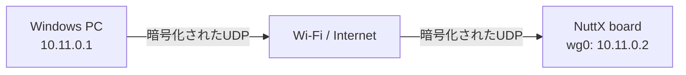
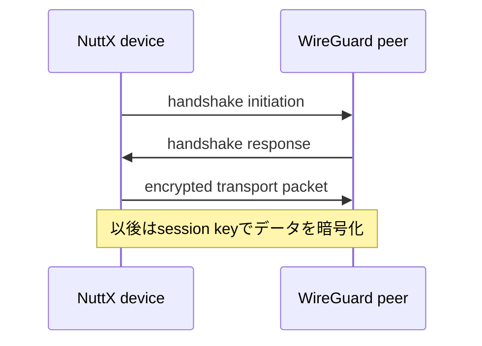
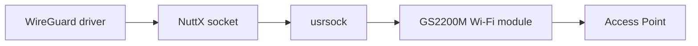
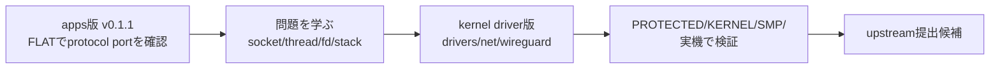
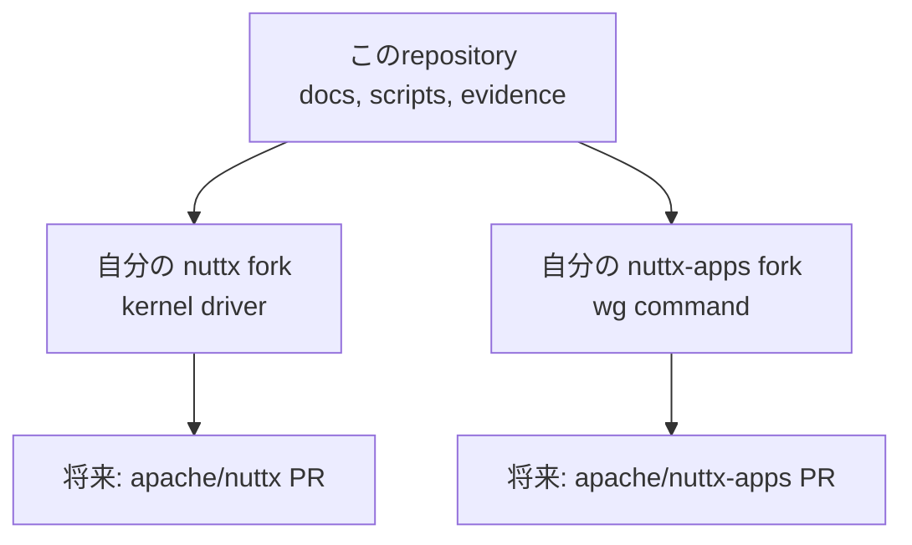
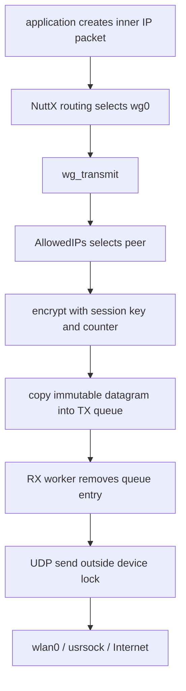
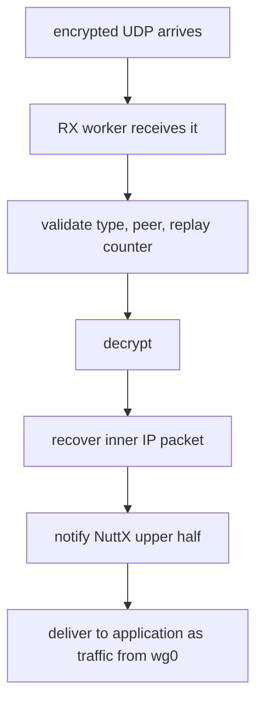

# はじめて理解する WireGuard for Apache NuttX

Community Over Code Glasgow の発表を、自分の言葉で説明するための日本語学習ガイド。
対象は「大学1年生程度のプログラミング経験はあるが、OS・ネットワーク・暗号・組込みの
専門知識はまだない」人です。

この文書の目的は、発表原稿を暗記することではありません。次の3つを理解することです。

1. 何を作ったのか
2. なぜ難しかったのか
3. 何を確認できて、何がまだ未解決なのか

実装と試験結果の正本は、[現行設計](../upstream/in-kernel-design.md)と
[検証マトリクス](../upstream/verification-matrix.md)です。この文書は、それらを読む前の
「やさしい地図」です。

発表は[スライド](coc-glasgow-slides.html)44枚で、7つの部に分かれています。まず
[この発表の地図](#この発表の地図)で全体の流れをつかみ、[部ごとの学習ルート](#部ごとの学習ルート)で
「その部を理解するには、この文書のどの章を読めばよいか」を確かめてください。1枚ずつの細かい解説は
[スライド別解説](coc-glasgow-slide-guide-ja.html)、読み上げる言葉は[日本語台本](talkscript/coc-glasgow-script-ja.md)
にあります。この文書は「トピック順の読み物」、スライド別解説は「スライド順の辞書」という分担です。

---

## 0. 最初にこれだけ

### 30秒で説明すると

小さな組込み機器向けOSである **Apache NuttX** に、**WireGuardというVPN**を追加しました。
NuttX上に`wg0`という仮想ネットワーク機器を作り、そこへ届いたIPパケットを暗号化して、
普通のWi-FiからUDPパケットとして送ります。

```text
通常の通信
  アプリ → IPパケット → Wi-Fi → インターネット

今回の通信
  アプリ → IPパケット → wg0で暗号化 → UDP → Wi-Fi → インターネット
                                      ↓
                                相手が復号する
```

作ったものは2段階あります。**第1版**はアプリとして作った版(apps版、v0.1.1)、**第2版**は
NuttXのカーネルの中に入れた正式なドライバ(カーネル版)です。どちらもESP32-S3とSPRESENSEの
実機で、本物のWireGuard実装(LinuxカーネルのWireGuard、Windowsの公式クライアント)とつながることを
確認しました。さらに、単にpingが通るだけでは見つからない、並行処理、鍵、時刻、メモリ、再起動の問題まで
調べました。

### 「どこで確かめたか」の印

この発表では「何を、どの版で、どこで確かめたか」を混ぜないことがとても大切です。この文書では次の印を
使います。

| 印 | 意味 |
|---|---|
| **[apps・実機]** | 第1版(apps版 v0.1.1)を本物のボードで確かめた |
| **[カーネル・sim]** | 第2版(カーネル版)を、PCの上で動くNuttXのシミュレータ(sim)で確かめた |
| **[カーネル・QEMU]** | 第2版を、QEMUという仮想マシンの上の本物のカーネルビルドで確かめた |
| **[カーネル・実機]** | 第2版を本物のボードで確かめた |
| **[未解決]** | 問題が残っている、またはまだ試していない |

たとえば「カーネル版がLinuxのWireGuardとつながる」は **[カーネル・sim]** と **[カーネル・QEMU]** で、
「カーネル版が実機でつながる」は **[カーネル・実機]**(相手はWindowsの公式クライアント)です。
apps版は両ボードでLinuxとWindowsの両方とつながりました **[apps・実機]**。発表の最後のライブデモ
(スタックちゃん)は **apps版** です([18.6](#186-なぜライブデモはapps版なのか))。

### この発表の中心メッセージ

> **浅い試験は通る。深い試験で壊れる。**

ハンドシェイクやpingが成功しても、安全で、長く動き、停止でき、再起動後も復帰できるとは
限りません。このプロジェクトでは「動いた」の先を調べたことで、本当の問題が見つかりました。

---

## この発表の地図

発表は全部で44枚、7つの部に分かれています。スライド1はタイトル、スライド2は目次です。部が変わる
たびに目次のスライドに戻ってきて、今どこにいるかを示します(スライド3・11・16・19・28・35・38)。

| 部 | 英語の題 | この部が答える問い | スライド | 時間の目安 |
|---|---|---|---|---:|
| 第1部 | Overview & background | 誰が、何を作ったのか。NuttXとはどんなOSで、なぜこの人がそこにいたのか | 3〜10 | 約6分 |
| 第2部 | The problem and the idea | 遠くに置いた機器へ、安全に届くにはどうすればよいか。なぜWireGuardなのか | 11〜15 | 約4分 |
| 第3部 | The plan | 既存のWireGuardの実装をどう再利用し、NuttXにどうはめこむか | 16〜18 | 約1分 |
| 第4部 | Version 1: the app | 第1版(アプリ)は動いた。では「動いた」の裏に何が隠れていたか | 19〜27 | 約5分 |
| 第5部 | Version 2: the kernel driver | なぜカーネルへ移したのか。正しく動くことを、どうやって確かめたのか | 28〜34 | 約13分 |
| 第6部 | Live demo | 実物では、どう見えるのか | 35〜37 | 約3分 |
| 第7部 | Summary & next steps | 実際に運用するには。この先どうするのか。何を持ち帰ればよいか | 38〜44 | 約4分 |

時間はスライド2の目安です。台本どおりに読むと合計約38分(デモ90秒を含む)なので、本番では
30分枠に収まるよう削る順番(41 → 40 → 39)が[台本](talkscript/coc-glasgow-script-ja.md)に決めてあります。
いちばん時間を使うのは第5部の検証(スライド32〜34)で、ここは削りません。

### 話の筋(ストーリーライン)

まず、**なぜ必要か**。小さな組込みOSのNuttXで作った機器は、現場に置いた後に遠くから安全に
つなぐ方法がありませんでした(第1部・第2部)。そこで、標準のVPNであるWireGuardを、NuttXの普通の
ネットワーク機器`wg0`として加えることにしました。次に、**どう作る計画か**。暗号とプロトコルは既存の
実装をそのまま使い、OSに依存する部分だけを置き換えます(第3部)。**第1版**はアプリとして作り、
すぐに動きました。ところが「動いた」の裏には、pingでは見えない**隠れたバグ**が5つありました(第4部)。
そこで**第2版**では、正式なドライバとして**カーネルの中へ**移し、さらに2つのバグを見つけ、
シミュレータ・仮想マシン・実機で**どこまで確かめたか**を一つずつ測りました(第5部)。その上で、
スタックちゃんという**実物**で、トンネル越しに操作する様子を見せます(第6部)。最後に、運用・移植性・
本家への還元をまとめ、3つの教訓と謝辞で**まとめ**ます(第7部)。

```text
なぜ必要か → どう作る計画か → 第1版で動いたが隠れたバグ → 第2版でカーネルへ・確かめ方 → 実物 → まとめ
 (第1・2部)     (第3部)          (第4部)                     (第5部)                  (第6部) (第7部)
```

---

## 部ごとの学習ルート

各部について、「スライドごとの要点」「先に読んでおく基礎」「どこで確かめたか」をまとめます。
基礎の章へのリンクは、知らない言葉が出てきたときに戻る場所です。全部を一度に読む必要はありません。

### 第1部 概要と背景

**スライド3〜10、約6分。** 問い:誰が、何を作ったのか。NuttXとはどんなOSか。

| スライド | 題 | 要点 | この文書の章 |
|---:|---|---|---|
| 4 | About Me | ソニーのエッジAIエンジニアで、NuttXには**アプリの側**から関わってきた。ドライバを書くのは今回が初めて | [6.6](#66-発表者とこのプロジェクトの始まり) |
| 5 | Overview | NuttXに`wg0`という仮想ネットワーク機器を足す。下の「線」はケーブルではなくUDPソケット | [8.1](#81-目的)、[7.1](#71-netdev) |
| 6 | How it started | 2月に調べ始め、9月にアプリからカーネルドライバへ作り直し、10月にこの発表 | [6.6](#66-発表者とこのプロジェクトの始まり) |
| 7 | What is Apache NuttX? | 小さなRTOSなのに、Unixと同じ書き方(POSIX、BSD socket、ファイル)ができる | [6.1](#61-rtosとは)、[6.2](#62-freertoszephyrnuttxの見方) |
| 8 | NuttX and other RTOSes | FreeRTOS・Zephyrとは重心が違う。星の数は少ないが、実際の製品で使われている | [6.2](#62-freertoszephyrnuttxの見方)、[6.4](#64-nuttxはどこで使われているか) |
| 9 | History | ソニーは2015年ごろからNuttXを製品に使い、upstreamにも貢献してきた | [6.5](#65-ソニーとnuttxの歴史) |
| 10 | Experience | 発表者の課題は「NuttXを動かすこと」ではなく「設置した後のNuttX機器にどう届くか」 | [6.6](#66-発表者とこのプロジェクトの始まり) |

- **先に読む基礎:** [2.1 IPアドレス](#21-ipアドレスは機器の住所)、[5. OS・kernel・driverの基礎](#5-oskerneldriverの基礎)、
  [6. RTOSとApache NuttX](#6-rtosとapache-nuttx)、[7.1 netdev](#71-netdev)
- **どこで確かめたか:** この部は経歴と歴史なので、技術的な試験の対象ではありません。GitHubの星の数は
  変わるので、スライドの日付(2026年10月)と一緒に言います。

### 第2部 課題とアイデア

**スライド11〜15、約4分。** 問い:遠くの機器へ安全に届くには? なぜWireGuardなのか。

| スライド | 題 | 要点 | この文書の章 |
|---:|---|---|---|
| 12 | Problem | Wi-Fiの暗号(WPA2/WPA3)が守るのは、機器とアクセスポイントの間の一区間だけ | [3.4](#34-wi-fiの暗号はどこまで守るか) |
| 13 | Options | ポート開放、HTTPS、MQTT、リバーストンネル、ルーターのVPN、キャリア閉域網、機器のVPNを比べる | [3.5](#35-ほかの手段との比較) |
| 14 | Why WireGuard | 小さく、UDPで動き、公開鍵で相手を識別し、LinuxやWindowsに標準である | [3.3](#33-wireguardが登場する理由) |
| 15 | Architecture | アプリ → TCP/UDP/IP → `wg0` → 暗号化 → UDPソケット → `wlan0`/`usrsock` | [9](#9-パケットはどう流れるか)、[7.4](#74-usrsock) |

- **先に読む基礎:** [2. ネットワークの基礎](#2-ネットワークの基礎)(IP、ポート、TCP/UDP、socket、NAT)、
  [3. VPNとWireGuard](#3-vpnとwireguard)、[4.1 peer](#41-peer)、[4.2 秘密鍵と公開鍵](#42-秘密鍵と公開鍵)
- **どこで確かめたか:** 比較表は設計の判断で、試験ではありません。表の「NuttXに今あるもの」の列は
  nuttx-apps 13.0.1 に入っているクライアントです。

### 第3部 計画

**スライド16〜18、約1分。** 問い:既存のWireGuardをどう再利用し、NuttXにどうはめこむか。

| スライド | 題 | 要点 | この文書の章 |
|---:|---|---|---|
| 17 | Porting | wireguard-lwipの暗号とプロトコルはそのまま。OS依存は4つの関数だけ。lwIP依存のつなぎ込みを置き換える | [8.4](#84-ゼロから書かなかった) |
| 18 | Design | lwIPの部品をNuttXの部品へ写す(`netif`→`net_driver_s`、`pbuf`→`iob` など) | [8.4](#84-ゼロから書かなかった)、[7.2](#72-upper-halfとlower-half)、[7.3](#73-iob) |

- **先に読む基礎:** [2.5 socket](#25-socketとは)、[5.3 driver](#53-driver)、[7.1〜7.3 netdev・upper/lower half・IOB](#7-nuttxネットワーク用語)
- **どこで確かめたか:** 計画なので試験はありません。計画どおりだったかの答え合わせは第7部のスライド40です。

### 第4部 第1版: アプリ

**スライド19〜27、約5分。** 問い:第1版は動いた。では「動いた」の裏に何が隠れていたか。

| スライド | 題 | 要点 | この文書の章 |
|---:|---|---|---|
| 20 | Result | 暗号とプロトコルの3,079行は元と完全に同じ。鍵や相手の設定を、作り直しなしに動作中に変えられる | [8.4](#84-ゼロから書かなかった) |
| 21 | The Testing Pattern | 浅い試験は通り、深い試験で落ちる。浅い試験が通ると、その部分を疑わなくなる | [0](#この発表の中心メッセージ)、[14](#14-なぜpingだけでは足りないのか) |
| 22〜26 | Bug 1〜5 | 効かないタイムアウト、消えるスレッド、別タスクのfd、50 msのポーリング、測っていなかったスタック | [13](#13-発表に出てくる7つの落とし穴) |
| 27 | Version 1 demo | 第1版でtelnetとWebページがトンネル越しに使える動画 | [18.2](#182-第1版の動画スライド27) |

- **先に読む基礎:** [2.5 socket](#25-socketとは)、[5.4 threadとtask](#54-threadとtask)、
  [8.2 2段階の開発](#82-2段階の開発)。fd(file descriptor)とstackは[用語集](#21-用語集)にもあります。
- **どこで確かめたか:** 第1版の結果と動画は **[apps・実機]**(ESP32-S3、相手はWindowsの公式クライアント)。
  バグ5のスタック94%はESP32-S3の実機で測った値です。

### 第5部 第2版: カーネルドライバ

**スライド28〜34、約13分。** 問い:なぜカーネルへ移したのか。正しく動くことを、どうやって確かめたのか。
発表の重心はここ、特にスライド32〜34です。

| スライド | 題 | 要点 | この文書の章 |
|---:|---|---|---|
| 29 | Into the kernel | 第1版はFLATビルドでしか動かない。正式なドライバにするにはカーネルへ | [7.5](#75-flatprotectedkernel-build)、[8.2](#82-2段階の開発) |
| 30 | The Kernel Design | ドライバがソケットとスレッドを持つ。ポインタなしのioctl ABI。秘密鍵はwrite-only | [8.5](#85-現行driverの主なfile)、[10](#10-ioctlとabi)、[11](#11-並行処理をどう安全にしたか)、[12](#12-起動と停止のライフサイクル) |
| 31 | Two more bugs | NuttX自身の暗号のnonceのバグ、カーネルビルドだけで起きたスタックあふれ | [4.6](#46-nonceとcounter)、[13](#13-発表に出てくる7つの落とし穴) |
| 32 | Testing: seven places | sim、QEMUの3構成、SPRESENSEの実測、両ボードの実Wi-Fi、apps版 | [15](#15-検証結果の読み方) |
| 33 | What ping misses | 毎回同じ鍵、downの後に残る鍵、時間がたってから出るリーク | [14](#14-なぜpingだけでは足りないのか)、[16](#16-鍵乱数ゼロ化) |
| 34 | Design choice: trust the clock? | 再起動の後も新しいtimestampが要る。RTCのない機器には無料の答えがない | [17](#17-最大の未解決事項-tai64nと再起動) |

- **先に読む基礎:** [5.2 kernelとuser space](#52-kernelとuser-space)、[7.5 FLAT/PROTECTED/KERNEL](#75-flatprotectedkernel-build)、
  [10 ioctlとABI](#10-ioctlとabi)、[11 並行処理](#11-並行処理をどう安全にしたか)、[4.6 nonce](#46-nonceとcounter)、
  [4.7 replay attack](#47-replay-attack)
- **どこで確かめたか:** 行ごとに違います。[15.1](#151-主な検証環境)の表で確かめてください。特に、
  **PROTECTEDビルドの実行は、繰り返すと8回中2回失敗していて未解決** **[未解決]**、
  **#14(再起動後のtimestamp)は判断としてopen** **[未解決]** です。

### 第6部 ライブデモ

**スライド35〜37、約3分。** 問い:実物では、どう見えるのか。

| スライド | 題 | 要点 | この文書の章 |
|---:|---|---|---|
| 36 | Demo setup | 会場のWi-Fiは機器どうしの通信を止めるので、スマホのテザリングで小さなネットワークを作る | [18.3](#183-デモの構成スライド36) |
| 37 | Demo | telnetでログインし、顔を変え、声を出させ、tcpdumpでトンネルの外と中を比べる | [18.4](#184-デモの7つの手順スライド37)、[18.5](#185-tcpdumpでトンネルの外と中を見比べる) |

- **先に読む基礎:** [2.1 IPアドレス](#21-ipアドレスは機器の住所)(物理とVPNの2種類のアドレス)、
  [3.2 tunnelとencapsulation](#32-tunnelとencapsulation)、[4.8 endpoint](#48-endpointとallowedips)、
  [4.9 PersistentKeepalive](#49-persistentkeepalive)
- **どこで確かめたか:** スタックちゃんのデモは **[apps・実機]**。カーネル版のデモではありません
  ([18.6](#186-なぜライブデモはapps版なのか))。

### 第7部 まとめと次の一歩

**スライド38〜44、約4分。** 問い:実際に運用するには。この先どうするのか。何を持ち帰ればよいか。

| スライド | 題 | 要点 | この文書の章 |
|---:|---|---|---|
| 39 | Running it for real | 鍵は動作中に作って設定する。4つの層を毎分確かめ、どこが落ちたかを言えるようにする | [19.1](#191-運用できる形にするスライド39) |
| 40 | Other CPUs | 4つの関数に閉じこめた賭けは当たった。apps版は4種類のCPUで変更なしに動いた | [19.2](#192-ほかのcpuスライド40) |
| 41 | Giving back | crypto修正 → ドライバ → コマンドの順に小さなPRで出す。PRはまだ出していない | [19.3](#193-本家への還元スライド41)、[8.3](#83-なぜリポジトリが3つあるのか) |
| 42 | Summary | 作ったもの(`wg0`)の1行と、3つの教訓 | [19.4](#194-summaryスライド42) |
| 43 | Thanks | Alan、NuttXコミュニティ、ASFとCoCの運営、ソニーのNuttX開発者への感謝 | [19.5](#195-謝辞スライド43) |
| 44 | Thank you | 質疑応答へ | [19.6](#196-thank-youスライド44) |

- **先に読む基礎:** [8.3 リポジトリ](#83-なぜリポジトリが3つあるのか)、[15.2 正しい言い方](#152-主な数字と正しい言い方)
- **どこで確かめたか:** スライド39・40は主に **[apps・実機]**。スライド42の「作ったもの」の1行は、
  版と相手ごとに分けて読みます([19.4](#194-summaryスライド42))。

---

## 1. どこまで知っていればよいか

### 発表前に必ず理解したいこと

| 分野 | 理解する内容 | 数式は必要か |
|---|---|---:|
| ネットワーク | IPアドレス、ポート、TCP、UDP、ルーター、NAT | 不要 |
| VPN | 元のIPパケットを暗号化し、別のパケットで運ぶ | 不要 |
| WireGuard | peer、公開鍵、秘密鍵、handshake、session key、counter | 不要 |
| OS | application、kernel、driver、threadの違い | 不要 |
| NuttX | RTOS、netdev、IOB、usrsock、FLAT/KERNEL/PROTECTED | 不要 |
| 並行処理 | lock、queue、semaphore、所有権 | 不要 |
| 検証 | PASSが何を証明し、何を証明しないか | 不要 |
| 時刻問題 | 再起動で時計が戻ると古いhandshakeとして拒否される | 不要 |
| デモ環境 | テザリング、クライアント分離、tcpdumpで見える外と中の違い | 不要 |
| 発表の背景 | 発表者の立ち位置、ソニーとNuttXの歴史、プロジェクトの経緯 | 不要 |

### 知らなくても発表できること

- ChaCha20やCurve25519の数式
- Noise Protocol Frameworkの証明
- NuttX schedulerの実装詳細
- TCP/IPの全ヘッダー形式
- Linuxカーネルの内部構造
- WireGuardプロトコルの全状態遷移

これらを質問された場合は、「使用した方式」「今回確認した性質」「確認していない範囲」を
答えれば十分です。暗号アルゴリズムを自作したわけではありません。

---

## 2. ネットワークの基礎

### 2.1 IPアドレスは機器の住所

IPアドレスは、ネットワーク上の機器やインターフェースを識別する番号です。

```text
PC                 Wi-Fiルーター              組込みボード
192.168.0.10  ───  192.168.0.1  ───────────  192.168.0.115
```

今回のデモでは、物理Wi-Fi用のアドレスとは別に、VPN内のアドレスを持ちます。

```text
物理ネットワーク:  wlan0 = 192.168.0.115
VPN内のネットワーク: wg0 = 10.11.0.2
```

`wlan0`は現実のWi-Fi装置、`wg0`はソフトウェアで作った仮想装置です。

上の数字は説明用の例です(VPN側の`10.11.0.2`は、スライド36に点線で出てくるSPRESENSEの`wg0`と
同じ値)。発表のライブデモ(スタックちゃん)では、`wlan0`は
スマホのテザリングが配るアドレス、`wg0`は`10.10.0.2`(相手のPC側は`10.10.0.1`)です。どちらの例でも
「物理の住所」と「VPNの中の住所」の2つを持つ、という形は同じです([18.3](#183-デモの構成スライド36))。

### 2.2 ポート番号は建物の受付番号

1台の機器では、Webサーバー、SSH、DNSなど複数の通信が動きます。IPアドレスが建物の住所なら、
ポート番号は「どの窓口に届けるか」を示す番号です。

```text
192.168.0.115:80     → Webサーバー
192.168.0.115:51820  → WireGuard
```

### 2.3 パケットは小分けにした通信データ

ネットワークでは、大きなデータを小さな単位に分けて送ります。この単位を**パケット**と呼びます。
パケットには、宛先、送信元、種類、本文などが入ります。

### 2.4 TCPとUDP

| | TCP | UDP |
|---|---|---|
| 考え方 | 接続を作り、順序と再送を管理 | 小さなメッセージをそのまま送る |
| 信頼性 | 欠落時に再送する | 基本的に再送しない |
| 順序 | 保証する | 保証しない |
| 例 | Web、SSH、ファイル転送 | DNS、映像、ゲーム、VPNの外側 |
| WireGuardとの関係 | VPNの中をTCPが通ることがある | WireGuard自身はUDPで運ばれる |

重要なのは、**WireGuardはTCPの代わりではない**ことです。TCPやUDPを含む元のIPパケット全体を、
WireGuardが暗号化してUDPで運びます。

### 2.5 socketとは

アプリケーションがネットワークを使うための入口です。

```c
socket();       // 通信用の入口を作る
bind();         // 自分のアドレス・ポートに結び付ける
sendto();       // 送る
recvfrom();     // 受け取る
```

**BSD socket API**は、多くのUnix系OSで使われる共通の形です。NuttXもこの形を持つため、
既存のネットワークソフトを移植しやすいことが、今回の重要な背景です。

### 2.6 NATとは

家庭や会社のWi-Fiでは、複数の端末が1つのグローバルIPアドレスを共有することが一般的です。
この変換をNATと呼びます。

```text
インターネット
     │ グローバルIPは1つ
 [ Wi-Fiルーター / NAT ]
     ├── PC       192.168.0.10
     ├── phone    192.168.0.20
     └── NuttX    192.168.0.115
```

外から突然`192.168.0.115`へ接続することは通常できません。そこで、内側の機器からVPNサーバーへ
接続し、安全な経路を作る方法が役立ちます。

### 2.7 subnet、CIDR、routing

IPアドレスを1台ずつではなく範囲で表す書き方がCIDRです。

```text
10.11.0.0/24
```

`/24`は先頭24 bitがnetworkを表すという意味です。初心者向けには、IPv4の`/24`なら、おおむね
`10.11.0.1`から`10.11.0.254`までが同じ小さなnetworkだと考えれば十分です。

**routing**は、宛先IPアドレスを見て「どのnetwork interfaceや次のrouterへ渡すか」を決める処理です。

```text
宛先 10.11.0.1      → wg0へ
宛先 192.168.0.1    → wlan0へ
それ以外            → default routerへ
```

WireGuardでは通常のroutingに加えてAllowedIPsからpeerも選びます。

---

## 3. VPNとWireGuard

### 3.1 VPNは「暗号化された仮想ケーブル」

VPNを使うと、離れた機器同士が同じ安全なネットワークにいるように通信できます。



たとえば、NuttXボードが遠隔地にあっても、VPN経由でログを取得したり、Web画面を開いたり、
更新作業をしたりできます。各アプリが独自の暗号通信を実装する必要はありません。

### 3.2 tunnelとencapsulation

VPNの中を通したい元のパケットを**inner packet**、外側で実際に運ぶパケットを
**outer packet**と呼ぶことがあります。

```text
外側のUDPパケット
┌──────────────────────────────────────┐
│ outer IP / UDP header                │
│  ┌────────────────────────────────┐  │
│  │ WireGuardで暗号化された本文    │  │
│  │  ┌──────────────────────────┐  │  │
│  │  │ 元のinner IP packet      │  │  │
│  │  └──────────────────────────┘  │  │
│  └────────────────────────────────┘  │
└──────────────────────────────────────┘
```

このように、あるパケットを別のパケットに包むことを**encapsulation**と呼びます。

### 3.3 WireGuardが登場する理由

スライド14の内容です。今回WireGuardを選んだ主な理由は次のとおりです。

| 理由 | 意味 |
|---|---|
| プロトコルが比較的小さい | 組込み機器へ移植しやすく、レビュー範囲も限定しやすい |
| UDPベース | NAT内の機器から接続を開始しやすい |
| 鍵によるpeer識別 | 証明書基盤を別に持たずに構成できる |
| 一般的な実装と相互接続 | LinuxやWindowsの既存WireGuardと通信できる |
| 仮想インターフェース | 既存アプリをVPN専用に書き換えなくてよい |

「小さい」は「簡単」や「暗号を適当に扱ってよい」という意味ではありません。実際には、時刻、nonce、
乱数、リプレイ防止、鍵消去など、厳密に扱う必要がある部分があります。

スライド14の台本には「正しい鍵を持たないpacketには一切返事をしない。外から見ればただのレンガの壁」
という一言があります。WireGuardは、知らない相手からのpacketに何も答えないので、外からは機器が
そこにいることすら分かりにくい、という意味です。

選んだのは「製品」ではなく、「独自のprotocolを発明する、またはvendorのcloudに頼る代わりに、
標準のprotocolを採用する」という方針です。

### 3.4 Wi-Fiの暗号はどこまで守るか

スライド12の内容です。Wi-Fiにも暗号(WPA2やWPA3)があります。ではなぜVPNが要るのでしょうか。

```text
技術者 ── インターネット ── ルーター/ネットワーク ── Wi-Fi ── NuttX機器
                                                    └─────────┘
                                         WPA2/WPA3が守るのはこの一区間だけ
```

Wi-Fiの暗号が守るのは、**機器とアクセスポイント(Wi-Fiの親機)の間の電波の区間だけ**です。
その手前のインターネットやルーターの中は、Wi-Fiの暗号の範囲の外です。必要なのは、技術者の
PCから機器まで**全部の道のり**を、認証と暗号で守ることでした。

それがないと、選択肢はどれも難点があります。

| 選択肢 | 問題 |
|---|---|
| 機器をインターネットに直接公開する | 世界中から届いてしまう。「祈る」しかない |
| 自分で安全なprotocolを作る | 作るのも、ずっと保守し続けるのも大変 |
| vendor(製品の会社)のcloudに任せる | 自分の機器に届くのに、他人のcloudに頼ることになる |

同じ問題は、エッジAI、産業用IoT、遠隔のインフラ全般にあります。このプロジェクトだけの話では
ありません。

### 3.5 ほかの手段との比較

スライド13の内容です。WireGuardを選ぶ前に、機器に届くための一般的な方法を比べました。
まず言葉を2つ説明します。

- **MQTT:** IoTでよく使う、小さなメッセージをやり取りするprotocol。機器もPCも**broker**という
  中継サーバーにつなぎ、brokerがメッセージを配る。
- **リバーストンネル/relay:** 機器のほうから外のサーバー(relay)へ接続を張っておき、外からはその
  サーバー経由で機器の1つのポートに届く仕組み。SSHやWebSocketで作る。

| 方法 | 誰からつなぐか | 任意のサービス(telnet、Web…)に届くか | 間にサーバーが要るか | 暗号が終わる場所 | NuttXに今あるもの |
|---|---|---|---|---|---|
| インターネットにポートを開ける | 技術者 → 機器 | はい | いいえ | アプリ(何もないことも多い) | 簡単だが、誰からでも届く |
| クラウドAPIへのHTTPS | 機器 → クラウド(定期的に問い合わせ) | いいえ、自分のAPIだけ | はい、Webサーバー | クラウドのサーバー | webclient、libcurl4nx + mbedTLS |
| MQTT broker(TLS) | 機器 → broker | いいえ、メッセージだけ | はい、broker | broker | mqttc、paho_mqtt + mbedTLS |
| リバーストンネル/relay(SSH、WebSocket) | 機器 → relay | トンネル1本につきポート1つ | はい、relayのホスト | relayのホスト | dropbear、libwebsockets |
| ルーターのVPN | ルーター ↔ 事務所 | はい、LAN全体 | いいえ | ルーター(LANの区間は守られない) | 機器は変更不要だが、そのルーターが要る |
| キャリアの閉域網(専用APN、SIMのVPN) | キャリア経由 | はい | はい、キャリア | キャリアのgateway | LTEモデム。セルラー回線だけ |
| **機器の上のVPN(この発表)** | どちらからでも | はい、任意のIPサービス | いいえ、普通のWireGuard peer | **機器そのもの** | `wg0` |

読み方のポイントは3つです。

1. **HTTPSとMQTTは、多くのIoT製品が使う正しい道具です。** 機器のほうから外へつなぐのでNATも問題に
   なりません([2.6](#26-natとは))。ただし届くのは自分で設計したメッセージだけで、機器にログインしたり
   Webページを開いたりはできません。暗号もbrokerやcloudで終わります。
2. **ルーターのVPNは、ルーターが自分のものなら良い方法です。** ただし最後のLANの区間は守られず、
   お客さんの現場のルーターはふつう自分のものではありません。
3. **3つの条件(任意のIPサービス、間にサーバーなし、機器までの暗号)を全部満たすのは、機器の上の
   VPNだけ**です。

これは「MQTTやHTTPSをやめよう」という話ではありません。データのやり取りには今でもそれらが正しく、
機器の上のVPNは**保守のためのアクセス**の道具です。TailscaleやZeroTierのようなmesh VPNも
「機器の上のVPN」ですが、今のところマイコンより大きなOSが必要なことが多い(スライドの脚注)です。

---

## 4. WireGuardの最低限の用語

### 4.1 peer

通信相手です。WireGuardでは、相手を主に**公開鍵**で識別します。

### 4.2 秘密鍵と公開鍵

| 鍵 | 扱い | たとえ |
|---|---|---|
| 秘密鍵 | 自分だけが持つ。漏らしてはいけない | 本人だけが持つ印鑑 |
| 公開鍵 | 相手に渡してよい | 相手が本人確認に使う印影情報 |

秘密鍵から公開鍵を計算できますが、公開鍵から秘密鍵を現実的な時間で逆算できない仕組みを使います。
今回の鍵共有ではCurve25519/X25519系の演算を利用します。

### 4.3 handshake

通信開始時に、お互いが正しい鍵を持つ相手かを確認し、短時間だけ使う**session key**を作る手続きです。



### 4.4 session keyとrekey

長期間ずっと同じ暗号鍵を使うのではなく、handshakeで一時的なsession keyを作ります。一定時間や条件で
新しい鍵へ切り替えることを**rekey**と呼びます。

### 4.5 encryptionとauthentication

- **暗号化:** 内容を第三者に読めなくする
- **認証:** 改ざんされていないこと、正しい鍵を持つ相手が作ったことを確認する

WireGuardのデータ保護ではChaCha20-Poly1305を使います。ChaCha20が主に暗号化、Poly1305が主に
改ざん検出を担当します。発表では内部の数式を説明する必要はありません。

### 4.6 nonceとcounter

同じ鍵で暗号化する場合でも、各パケットに異なる番号を使う必要があります。その材料がnonceです。
WireGuardのtransport packetでは、増加するcounterがnonceに使われます。

```text
packet 1 → counter 0
packet 2 → counter 1
packet 3 → counter 2
```

今回見つけたNuttXのChaCha20-Poly1305バグ(スライド31)では、counterをnonceの誤った位置に入れていました。
counter 0だけは正しい配置と誤った配置が偶然同じになるため、**最初のデータパケットだけ通り、
2つ目以降が失敗**しました。これは「浅い試験が通る」の代表例です。

### 4.7 replay attack

攻撃者が以前の正しいパケットを録画のように保存し、あとで再送する攻撃です。暗号を解けなくても、
「同じ命令をもう一度実行させる」ことができれば問題になります。

WireGuardはcounterやhandshake timestampを使い、古いものや重複したものを拒否します。

### 4.8 endpointとAllowedIPs

| 用語 | 意味 |
|---|---|
| endpoint | 暗号化したUDPを実際に送る相手のIPアドレスとポート |
| AllowedIPs | どのVPN内アドレスをどのpeerへ送るか、またどの送信元をそのpeerから許すか |

AllowedIPsは単なるアクセス許可リストではなく、送信先peerを選ぶ経路表の役割も持ちます。これを
**cryptokey routing**と呼ぶことがあります。

### 4.9 PersistentKeepalive

NATは、しばらく通信がない対応関係を忘れることがあります。NAT内のdeviceから一定間隔で小さな
packetを送ると、その通り道を維持できます。WireGuardの`PersistentKeepalive`はこのための設定です。
たとえば25秒なら、dataがなくても25秒ごとにkeepaliveを送ります。

### 4.10 cookieとDoS対策

攻撃者が大量の偽handshakeを送ると、公開鍵暗号の重い計算でCPUを使い切らせる可能性があります。
WireGuardは負荷が高いとき、送信元が本当にそのnetwork addressで応答を受け取れるかをcookieで確認し、
無制限に重い処理をしないようにします。

今回のnegative testでは、handshake flood時のcookie replyや、その後も正規tunnelが生きていることを
確認しています **[カーネル・sim]**。

---

## 5. OS・kernel・driverの基礎

### 5.1 OSは資源の管理者

OSはCPU時間、メモリ、ファイル、ネットワーク、機器を管理し、アプリに共通の使い方を提供します。

```text
┌──────────────────────────┐
│ applications             │  wg command, Web server, telnet
├──────────────────────────┤
│ OS / network stack       │  socket, IP, routing, filesystem
├──────────────────────────┤
│ device drivers           │  Wi-Fi, serial, virtual wg0
├──────────────────────────┤
│ hardware                 │  CPU, RAM, flash, radio
└──────────────────────────┘
```

### 5.2 kernelとuser space

- **kernel:** ハードウェアや重要資源を管理する、権限の強い部分
- **user space:** 通常のアプリが動く、制限された部分

分離すると安全性は上がりますが、アプリからkernel内のデータを直接触れません。そこで、決められた
入口を通して依頼します。この境界を越える代表例が**system call**や**ioctl**です。

### 5.3 driver

OSが特定の機器や仮想機器を扱うための部品です。今回の`wg0`は物理チップではありませんが、OSから
ネットワーク機器として見えるため、network driverとして実装します。

### 5.4 threadとtask

どちらも「実行の流れ」です。複数の処理が見かけ上または実際に同時に進みます。

```text
thread A: ユーザーから来たpacketを暗号化する
thread B: Wi-Fiから来たUDPを受信して復号する
thread C: wg showで状態を読む
```

同じデータを同時に変更すると壊れる可能性があります。これが並行処理の問題です。

---

## 6. RTOSとApache NuttX

### 6.1 RTOSとは

**Real-Time Operating System**の略です。「速いOS」ではなく、重要な処理が必要な時間内に動くことを
予測しやすいOSです。センサー、ロボット、車載機器、ドローンなどで使われます。

### 6.2 FreeRTOS、Zephyr、NuttXの見方

スライド7・8の内容です。これは優劣ではなく、設計の重心の違いです。

| OS | おおまかな重心 | 今回との関係 |
|---|---|---|
| FreeRTOS | 小さなreal-time kernelと周辺library | 必要な機能を組み合わせてfirmwareを作る |
| Zephyr | connected device向け統合platform | networkingやdevice ecosystemを広く統合する |
| Apache NuttX | 小さな機器にUnixに近いAPIを提供 | socket、filesystem、netdevとしてVPNを置きやすい |

NuttXはPOSIX/ANSIに近いAPI、BSD socket、VFS/filesystem、shellであるNSH、独自のTCP/IP stackを
持ちます。このため、組込みOSでありながらUnix系OSで使われる設計を持ち込みやすい特徴があります。

### 6.3 Apache Software Foundationとの関係

NuttXはApache Software Foundationのtop-level projectです。今回重要なのは組織説明ではなく、
開発が公開の場で行われ、コードだけでなく、設計理由、ライセンス、試験、保守可能性までレビュー
対象になることです。

「自分のボードで動いた」は完成条件ではありません。他のboard、build方式、利用者、maintainerが
扱える形にする必要があります。

### 6.4 NuttXはどこで使われているか

スライド8の右半分です。「小さなRTOS」と聞くと、おもちゃのように思うかもしれません。スライドは
数字で答えます(2026年10月時点のスライドの値)。

| 項目 | スライドの値 |
|---|---|
| CPUアーキテクチャ | 15種類以上 |
| 対応board | 300以上 |
| 設定のひな形(configuration template) | 1,500以上 |
| 実際の製品 | ソニー、PX4のドローン(flight controller)、Xiaomi OpenVela(1,000以上の製品)、日本の2024年の月面ミッション |

一方、GitHubの星の数は FreeRTOS 7.8k、Zephyr 16.5k、apache/nuttx 4.1k で、NuttXが3つの中で
いちばん少ないとスライド自身がはっきり言います。**星は「開発者からどれだけ目に留まるか」であって、
「何台の機器で動いているか」ではありません。** 星の数は変わるので、話すときはスライドの日付と一緒に
言います。

### 6.5 ソニーとNuttXの歴史

スライド9の内容です。これは発表者個人の話ではなく、会社としての歴史で、エッジAIより古い話です。

| 時期 | できごと |
|---|---|
| 2015年ごろ | ソニーの音声製品(audio products)にNuttXが入る |
| 2018〜19年 | SPRESENSEとそのチップCXD56xxで、音声・GNSS(衛星測位)・カメラ・マルチコアの対応がNuttXに加わる。2019年、ソニーのMasayuki Ishikawa氏がOpen Source Summit + Embedded Linux Conference Europeで発表 |
| 2020年 | ソニーの技術者がupstreamの大きな貢献者になる。Alin Jerpelea 氏(後にNuttXのproject management committeeの議長)が「A Journey from Fork to Mainline」(forkからmainlineへの旅)という題でNuttX Online Workshop 2020に登壇 |
| 2020年代 | カメラ、GNSS、センシングの製品へ広がる |

**fork**と**mainline**は[8.3](#83-なぜリポジトリが3つあるのか)で説明するforkと同じ意味です。会社の
中で分岐して使っていたNuttXを、本家(mainline)に戻していく流れのことです。

台本はここで大事な線を引きます。「一人の技術者がいたからソニーがNuttXを選んだ」という因果は
**言いません**。それを裏付ける一次資料がないからです。公開された講演や文書から言えるのは
「ソニーのNuttX利用はエッジAIより何年も前からあり、時間をかけてカメラ・GNSS・センシングへ広がった」
ということだけです。

### 6.6 発表者とこのプロジェクトの始まり

スライド4・6・10の内容です。

**発表者(スライド4)。** ソニーセミコンダクタソリューションズのエッジAIエンジニアで、Apache NuttXには
**アプリケーションの側から**関わっています。名古屋生まれ、大学は仙台、今は川崎に住んでいます。仕事の
外ではホビーエンジニアで、宇宙・半導体・ロボットまわりのものを作り、ハッカソンへの参加、ソフトウェア系
カンファレンスの運営、オープンソースの本の執筆もしています。SNSでは、スライドの狐のアイコンが本人です。
ここまでの道のりは、分子ロボティクス(BIOMODで世界一、2015年)→ 画像処理とAI → AITRIOSのエッジAI
カメラ → SPRESENSEの組込み開発(組込みアプリコンテストで世界3位)→ NuttXとWireGuard、です。
**エッジAI**は、AIの計算をcloudではなく現場の機器(カメラなど)の上で行うことです。

このスライドで一番伝えたいのは、「NuttXのkernel開発者として始めてVPNを足そうと思ったのではない。
アプリと運用の側からNuttXに何度も出会い、その立場では解けない課題に行き当たった」という立ち位置です。
ドライバを書くのは今回が初めてだったので、後半のカーネルドライバの話に重みが出ます。

**経験(スライド10)。** SPRESENSEでは、NuttXのSDKを使ってセンシング・カメラ・GNSS・LTEの
試作と組込み開発をしています。AITRIOSのエッジAIカメラ(ESP32とNuttXで作られている)では、カメラを
机の上ではなく実際の現場に設置して動かし続けるのが仕事です。どちらも「アプリ開発 → システムの統合
(system integration)→ 設置と運用(deployment & operation)」という方向からNuttXに近づいています。
そして課題は「NuttXをどう動かすか」ではなく、**「設置した後のNuttX機器に、どうやって届くか」**でした。
これが第2部の課題(スライド12)につながります。

**経緯(スライド6)。** 月ごとの流れです。

| 時期 | できごと |
|---|---|
| 2月中旬 | GSoCのテーマ一覧を読み、調べ始める |
| 3月上旬 | 計画をIssueにまとめて提案する |
| 3月20日 | Alanさんからこのカンファレンスのことを聞き、講演を申し込む |
| 4月上旬 | GSoCに応募する |
| 5月上旬 | 講演は採択、GSoCは不採択。それでも作り続けることにする |
| 6〜7月 | 少しずつ進める |
| 8月の休み | 開発の大部分 |
| 9月〜 | FLATのアプリ(第1版)からカーネルドライバ(第2版)へ作り直す |
| 10月11〜14日 | グラスゴーでこの発表 |

GSoC(Google Summer of Code)は、オープンソースのプロジェクトで夏の間に開発する人をGoogleが
支援するプログラムです。提案は採択されませんでしたが、作業は続きました。難しい後半のカーネルドライバは最後に作ったものです。
GSoCの名前が出てくるのは、この経緯のスライドと、最後の謝辞のスライドだけです。

---

## 7. NuttXネットワーク用語

### 7.1 netdev

network deviceの略です。Ethernetなら`eth0`、Wi-Fiなら`wlan0`、今回のWireGuardなら`wg0`です。

```text
NuttX network stack
    ├── eth0   physical Ethernet
    ├── wlan0  physical Wi-Fi
    └── wg0    virtual WireGuard tunnel
```

### 7.2 upper halfとlower half

NuttXのdriverを理解するための分け方です。

- **upper half:** OS共通のnetwork stack側
- **lower half:** 個別driver側。今回ならWireGuardの暗号化・UDP送受信

共通部分と機器固有部分を分けることで、新しいdriverを追加しやすくします。

### 7.3 IOB

**I/O Buffer**です。NuttXがnetwork packetを保持するための、個数に上限があるbuffer poolです。
組込み機器ではRAMが少ないため、必要なだけ無制限に確保する設計にはできません。

```text
IOB pool: [free][free][used][used][free] ...
```

枯渇時の動作を確認するため、simでpoolを小さくして実際にfreeを0まで減らし、落ちずに回復することを
確認しました。ただし、実機でIOBを枯渇させた試験とは別です。

### 7.4 usrsock

socket処理の一部を別のuser-space daemonや外部moduleへ渡す仕組みです。SPRESENSEでは、外付け
GS2200M Wi-Fi moduleとの通信にこの経路を使います。



ESP32-S3のnative Wi-Fiとは異なる経路なので、2つのboardで試すことには意味があります。

### 7.5 FLAT、PROTECTED、KERNEL build

| build | applicationとkernelの関係 | 今回の意味 |
|---|---|---|
| FLAT | 同じaddress space | 最初のapps版を作りやすい |
| PROTECTED | 権限・memoryを分離 | ABIが境界を越えて正しく動く必要がある |
| KERNEL | user processとkernelをより明確に分離 | 内部pointerやkernel APIをuser側から直接使えない |

最初のapps版は、NuttX内部socket APIを使うためFLAT向けでした。upstreamへ提出する現行版はdriverを
kernel側へ移し、user側の`wg` commandとはioctlで通信します(スライド29)。

現行版は、KERNEL buildではQEMU上で完全なtunnelとして動きました **[カーネル・QEMU]**。PROTECTED buildも
QEMU上でtunnelが通りましたが、同じ試験を繰り返すと8回中2回、user space側で例外が起きていて、原因は
まだ分かっていません **[未解決]**。だから「PROTECTEDで動く」とだけ言わず、「tunnelは通るが、
間欠的な失敗が未解決」と言います([15.1](#151-主な検証環境))。

---

## 8. このプロジェクトで作ったもの

### 8.1 目的

スライド5の内容です。NuttX機器へ、既存アプリから普通のnetwork interfaceとして使えるWireGuard VPNを
追加することです。アプリから見れば`wg0`は普通のinterfaceで、違うのはその下の「線」がケーブルではなく
UDPソケット(port 51820)だという点だけです。

```text
既存アプリをWireGuard専用に変更する: しない
独自VPNプロトコルを作る:             しない
Linux/WindowsのWireGuardと通信する:   する
NuttXの通常のnetdevとして見せる:      する
```

### 8.2 2段階の開発



| | apps版 | 現行kernel driver版 |
|---|---|---|
| 置き場所 | `apps/` | `drivers/net/wireguard/` |
| 主目的 | protocol portを早く成立させる | upstream可能な正式driverにする |
| socket所有 | command/task側に制約 | driverが所有 |
| 設定 | application内部 | user commandからioctl |
| build | 主にFLAT | FLAT/PROTECTED/KERNEL(PROTECTEDの実行は間欠的な失敗が未解決) |
| upstream対象 | 学習・実績の土台 | こちらが本命 |
| 発表での位置 | 第4部(スライド19〜27)と、第6部のライブデモ | 第5部(スライド28〜34) |

### 8.3 なぜリポジトリが3つあるのか

この作業では、役割の異なる3つのGit repositoryを使います。

| repository | 中身 | 最終的な行き先 |
|---|---|---|
| `gsoc2026-nuttx-wireguard` | 設計、試験script、証拠、発表資料、作業記録 | projectの調査・再現用 |
| `nuttx` fork | kernel、network driver、crypto修正、NuttX documentation | `apache/nuttx`へのPR |
| `nuttx-apps` fork | user-spaceの`wg` command | `apache/nuttx-apps`へのPR |

**fork**は、GitHub上で本家repositoryを自分のaccountへ分岐したものです。この文脈のforkは、processを
複製するUnixの`fork()`とは別の言葉です。



driverとcommandを別PRにできるのは、本家NuttXでもkernel本体とapps collectionが別repositoryだからです。
さらに、既存NuttX cryptoのnonce修正はWireGuard driverから独立して役立つため、別の`crypto:` PR候補に
分けます。

### 8.4 ゼロから書かなかった

既存の`wireguard-lwip`実装を出発点にしました。

```text
再利用できた部分
  ├── WireGuard protocol
  ├── handshake state machine
  ├── replay protection
  └── portable crypto code / interface

NuttX向けに置き換えた部分
  ├── lwIP netif  → NuttX netdev
  ├── lwIP pbuf   → NuttX IOB
  ├── network callbacks
  ├── socket/thread lifecycle
  └── configuration ABI and command
```

暗号protocolを一から書くのではなく、OS依存の境界を置き換える戦略です。

スライド17・18・20では、この戦略を3つの層で説明します。

| 層 | 扱い | 中身 | 第1版での結果(スライド20) |
|---|---|---|---|
| Protocol & crypto | **そのまま使う**(KEEP) | handshake、transport、BLAKE2s、ChaCha20-Poly1305、Curve25519。OSに依存しない移植可能なC | 3,079行、元と完全に同じ |
| Platform hooks | **合わせる**(ADAPT) | `wireguard-platform.h`の裏の4つの関数:時計、乱数、TAI64N時刻、負荷の確認 | 小さい。時計、`/dev/urandom`、TAI64N、負荷 |
| lwIP network glue | **置き換える**(REPLACE) | lwIPのnetifの登録とbuffer。NuttXにはlwIPがない | 本当の作業。netdev + UDPソケット + 受信task |

置き換えるときは、lwIPをNuttXに持ち込むのではなく、lwIPの考え方をNuttX自身の部品へ1つずつ写しました
(スライド18)。

| 考え方 | lwIP | NuttX |
|---|---|---|
| ネットワーク機器 | `struct netif` | `struct net_driver_s` |
| buffer | `pbuf` | `iob` |
| 登録 | `netif_add()` | `netdev_register()` |
| 送信を始める | callback | `devif_poll()` |

`wg0`は`NET_LL_TUN`型(IP packetを直接扱うTUN型)のnetdevとして登録され、その下の「線」がUDPソケットです。
そして第1版は動きました。鍵の生成、peerの設定、設定fileの読み込み(`wg genkey` / `set` / `setconf`)を、
作り直しなしに動作中に行えます **[apps・実機]**。ただしスライド20の台本が言うとおり、ここまでが
「一番安く手に入る到達点」で、この後の話はほとんど、その「動いた」が何を隠していたかです。

### 8.5 現行driverの主なfile

| file | 役割 |
|---|---|
| `drivers/net/wireguard/wireguard.c` | netdev、socket、worker、TX/RX、ioctl、停止処理 |
| `drivers/net/wireguard/wg_noise.c` | handshake、session、replay、cookieなどのprotocol core |
| `drivers/net/wireguard/wg_crypto.c` | NuttXのcrypto機能をWireGuardから呼ぶ薄い層 |
| `drivers/net/wireguard/wg_tai64n.c` | realtime timestampと起動内high-water mark |
| `include/nuttx/net/wireguard.h` | user側とkernel側が共有するioctl ABI |
| `apps/system/wg/` | `wg up`, `wg set`, `wg show`などのuser command |

スライド30(The Kernel Design)は、この形を4つの点でまとめます。

1. **kernelのnetdev:** driverがUDPソケット、受信thread、timer、cookieを自分で持つ。だから第1版の
   「起動したcommandが終わるとthreadも死ぬ」「fdが別taskから使えない」という問題は、設計上起きない
2. **ポインタのないioctl ABI:** PROTECTED/KERNEL buildではkernelが呼び出し元の構造体をそのままコピーするので、
   中にポインタを入れない([10](#10-ioctlとabi))
3. **秘密鍵はwrite-only:** getのioctlは秘密鍵を返さない([10.3](#103-秘密鍵がwrite-onlyとは))
4. **kernelの暗号はNuttX自身のもの:** BLAKE2s、ChaCha20-Poly1305、Curve25519はNuttXの`crypto/`を使う。
   外から持ってきたcodeはkernelにはなく、唯一の例外はuser側の`wg` commandにあるMITライセンスの
   小さなX25519(offlineで鍵を作る`genkey`用)だけ

---

## 9. パケットはどう流れるか

スライド15(Architecture)の図を、もう一段くわしくした章です。

### 9.1 送信方向

例: NuttXからVPN内のPC `10.11.0.1`へpingを送る。



大事な点は、暗号化したbufferをそのまま長時間socketへ渡さないことです。送信待ちの間に別threadが
同じbufferを書き換えると、暗号文が壊れるためです。そこで、完成したdatagramと宛先を独立した
queue entryへコピーします。

### 9.2 受信方向



### 9.3 control planeとdata plane

| plane | 何を扱うか | 例 |
|---|---|---|
| data plane | 実際のpacket | 暗号化、復号、送信、受信 |
| control plane | 設定と状態 | 鍵、peer、endpoint、up/down、`wg show` |

user-spaceの`wg` commandはioctlを通じてcontrol planeを操作します。packetごとにuser commandを
呼ぶわけではありません。

---

## 10. ioctlとABI

### 10.1 ioctlとは

通常のread/writeだけでは表現しにくいdevice操作を、applicationからdriverへ依頼する仕組みです。

```text
user space                         kernel
wg set peer ...  ── ioctl ──────> WireGuard driver
wg show          <─ ioctl ─────── peer/status information
```

### 10.2 ABIとは

**Application Binary Interface**です。ここでは、user側とkernel側がどの番号、どの構造体layoutで
情報を交換するかという契約です。

現行設計では構造体を固定長・pointerなしにしています。user側のpointerをkernelが追いかける設計は、
address spaceの違いや不正なpointerの扱いを難しくするからです。

### 10.3 秘密鍵がwrite-onlyとは

`wg` commandから秘密鍵を設定できますが、driverのget ioctlは秘密鍵を返しません。ただし、
**秘密鍵がkernelから一度も外へ出ないという意味ではありません**。再起動後に設定を復元するため、
user側の設定fileが正本として秘密鍵を保持します。

---

## 11. 並行処理をどう安全にしたか

スライド30の「driverがsocketとthreadを持つ」設計を、内側から見た章です。発表では時間の都合で
詳しく話しませんが、質疑で聞かれやすいところです。

### 11.1 何が危険か

次の処理は同時に起こり得ます。

```text
A: application packetを暗号化する
B: handshake responseを作る
C: wg setでpeer設定を変える
D: wg downで停止する
E: socket sendがWi-Fi backend内で待つ
```

同じpeer状態、鍵、暗号buffer、queueを同時に触ると、破損やuse-after-freeにつながります。

### 11.2 lock

lockは「この共有データを今触っているのは1つだけ」にする仕組みです。現行driverでは、protocolと
peerの状態を各netdevの`d_lock`で守ります。

```text
lockを取る → shared stateを読む/変更する → lockを離す
```

ただし、時間のかかるsocket送信中ずっとlockを持つと、設定表示や停止まで待たされます。

### 11.3 queueで所有権を切り離す

そこで送信を2段階に分けました。

```text
lockの内側
  1. protocol stateを使って暗号化
  2. 完成したdatagramを独立したqueue entryへコピー
  3. queueへ渡す

lockの外側
  4. RX workerだけがsocketへ送る
  5. 送信後にentryを解放
```

queueへ渡した後のdatagramは**immutable**、つまり変更しません。送信側は生のpeer pointerやkeypairを
持ち出しません。これにより、usrsockが長く待っても、protocol stateや共有暗号bufferを壊しません。

### 11.4 backpressure

送信要求が送信速度を上回ると、queueが無限に増えてRAMを使い切ります。そこでqueue上限を4 entryに
しています。満杯なら待ち続けずdropします。組込みでは、有限資源をどこまで使うかを明示することが
重要です。

### 11.5 starvation対策

受信packetが無限に来ると、timerや送信処理が永久に後回しになる可能性があります。受信は1回の
loopで最大16 datagramまでというbudgetを持ちます。

---

## 12. 起動と停止のライフサイクル

### 12.1 状態の流れ

```mermaid
stateDiagram-v2
    [*] --> Registered
    Registered --> Up: socket open / RX worker start
    Up --> Stopping: wg down
    Stopping --> Down: worker exit / socket close / sessions wipe
    Stopping --> Stopping: timeout; resources retained
    Stopping --> Down: repeated down reaps worker
    Down --> Up: wg up
```



### 12.2 なぜ停止が難しいか

RX workerがsocket内で待っている最中に、別threadがsocketやsemaphoreを破棄すると、workerは消えた
資源へアクセスするかもしれません。これはuse-after-free級の問題です。

現行設計は次の順序を守ります。

1. 新しい仕事を止める
2. workerを起こす
3. worker終了を待つ
4. 終了を確認してからsocketやsemaphoreを破棄する
5. session keyとqueueを消去する

時間内にworkerが終了しなければ、無理にsocketを閉じません。timeoutを返して資源を保持し、再度
`down`したときに回収します。失敗を隠して危険なcleanupを続けない設計です。

---

## 13. 発表に出てくる7つの落とし穴

1〜5は第1版(apps版)で、6・7は第2版(カーネル版)で見つかったものです。どれも
「浅い試験は通る。深い試験で壊れる」(スライド21)という同じ形をしています。

| # | スライド | 表面上は | 実際の問題 | 学び |
|---:|---:|---|---|---|
| 1 | 22 | `setsockopt`が成功 | timeoutが効かず`recvfrom`が永久待ち | success returnだけを信じない |
| 2 | 23 | detached threadを作った | launcher終了とともにthreadも終了 | detachは寿命を保証しない |
| 3 | 24 | pingとTCP handshakeが通る | 別taskからのsendが`EBADF` | fdの所有範囲を理解する |
| 4 | 25 | 50 ms pollingは小さな損 | 全packetが最大50 ms待ち、約10倍低速 | 性能影響を測る |
| 5 | 26 | simで動く | 実機の小さいstackでoverflow寸前。shellのredirectで設定を保存すると実機だけ固まる | target上で資源を測る |
| 6 | 31 | handshakeと最初のdataが通る | nonceのcounter配置が誤り、2 packet目以降失敗 | 境界値0だけで試さない |
| 7 | 31 | FLAT/simで設定できる | kernel stack上の約6 KB配列でoverflow | 本物のbuild分離とstackサイズで試す |

### 1つ目のdeadlockをもう少し

**deadlock**は、お互いを待って誰も進めなくなる状態です。受信のtimeoutが効かなかったので、次の輪が
できました。timerが動かない → handshakeの開始要求が送られない → peerが何も返さない →
`recvfrom`が戻らないのでtimerが動かない。設定関数が0(成功)を返しても、そのoptionが実際に効くとは
限らない、という例です。

### `EBADF`の話をもう少し

apps版ではsocketを整数のfile descriptorとして扱いました。NuttXではfdがtask groupに属するため、
別のtaskから同じ整数を使っても同じsocketを指すとは限りません。受信task自身が返すpingや
SYN-ACKは成功し、別taskからのdataだけ失敗したため、pingでは見抜けませんでした。

第1版の修正では、fdを経由せず、NuttXの内部socket API(`psock_*()`)で`struct socket`を直接使う形に
しました。`struct socket`はただのmemoryなので、どのtaskからでも使えます。第2版では、この
`struct socket`をkernelのdriverが所有する形にしました(スライド24・30)。

この修正には副作用がありました。`poll`はfdを使う仕組みなので、fdをやめると`poll`も使えなくなります。
そこで応急処置として50 msごとに確認(polling)したのが、4つ目の「約10倍遅い」の原因です(スライド25)。
本当の修正は、`psock_poll()`へのcallbackとsemaphoreによる正しい待ち方でした。

### 5つ目をもう少し

スライド26には2つの話があります。1つは、shellのredirect(`wg showconf > /data/wg0.conf`のように
出力をfileへ書く操作)で設定を保存すると、実機のflash file system(SPIFFS)でだけboardが固まったこと。
simでは一度も再現せず、file自身を書く`wg saveconf`を足して解決しました。もう1つは受信taskの
**stack**(関数呼び出しやlocal変数に使う、threadごとのmemory)です。受信taskは自分のstackの上で
IP stackを呼ぶので、TCPの呼び出しの深さ全体と、すぐ返事をするpacketの暗号化までがそこに乗ります。
既定の3072 byteは誰も測ったことのない数字で、実機で測ると94%使っていて、残りは176 byteだけでした
**[apps・実機]**。この話は第2版で2回戻ってきます。スライド31(バグ7、kernelのstackあふれ)と、スライド32(第2版の
受信threadをSPRESENSEで実測すると6096 byte中1472 byte **[カーネル・実機]**)です。

---

## 14. なぜpingだけでは足りないのか

pingは便利ですが、確認できる範囲は狭いです。

| pingが通っても分からないこと | 深い確認方法 |
|---|---|
| 2 packet目以降も正しく暗号化できるか | 継続traffic、TCP転送 |
| TCPの別taskから送信できるか | telnet、HTTP、file transfer |
| 鍵が毎回異なるか | 複数回resetして鍵を比較 |
| `down`後にsession keyが残らないか | live process memoryを検査 |
| 長時間でmemory leakしないか | soak testと資源sampling |
| kernel/user境界を越えられるか | PROTECTED/KERNEL buildで実行 |
| Wi-Fi backendが止まっても安全か | stallを注入し、controlとstopを試す |
| 再起動後もinitiatorになれるか | peer状態を残し、board側だけから再接続 |

**試験は、期待する成功を確認するだけでなく、間違った実装なら失敗する形にする**必要があります。

スライド33は、このうち3つを例に出します。毎回同じ秘密鍵になる問題、`down`の後にsession keyが残る問題、
何時間もたってから出るleakです。どれも「pingが通れば気づくか?」の答えは「気づかない」で、
**普通の試験を全部通りながら壊れている**ことがあり得ます。確かめ方は[16](#16-鍵乱数ゼロ化)と
[15.2](#152-主な数字と正しい言い方)にあります。

---

## 15. 検証結果の読み方

### 15.1 主な検証環境

スライド32(Testing: seven places)は、どの版をどこで確かめたかを7行の表にしています。

| 場所 | 版 | 確かめたこと | 印 |
|---|---|---|---|
| `sim:wireguard` | カーネル版 | errorなしでbuildできる(CIがbuildする構成) | [カーネル・sim] |
| rv-virt `knetnsh64` | カーネル版、BUILD_KERNEL | virtio-net越しにLinuxのWireGuardとtunnel。`wg`は別のprogramとして読み込まれ、system callでdriverに届く | [カーネル・QEMU] |
| rv-virt `pnsh64` | カーネル版、BUILD_PROTECTED | MPUの分離ありでtunnelが通る。`wg`はuser側にあり、すべてのioctlが境界を越える。**ただし繰り返すと8回中2回、user spaceで例外(open)** | [カーネル・QEMU] [未解決] |
| rv-virt `knetnsh64_smp` | カーネル版、SMP 4 CPU | 設定変更とdown/upをしながら大量のtraffic。例外なし、tunnelは復帰 | [カーネル・QEMU] |
| SPRESENSE(実測) | カーネル版、Cortex-M4F | 負荷と40回のdown/upの前後で、heap・buffer・stackが完全に同じ。受信threadは6096 byte中1472 byte | [カーネル・実機] |
| ESP32-S3 + SPRESENSE | カーネル版、実Wi-Fi | Windowsの公式clientとのtunnel。ESP32-S3は内蔵Wi-Fiでping 4/4、SPRESENSEはusrsock経由で6/6 | [カーネル・実機] |
| 同じ2つのboard | apps版 v0.1.1 | LinuxとWindowsのpeer。telnet、HTTP、7 MBの転送、rekey、電源断からの復帰 | [apps・実機] |

スライドの脚注のとおり、実機の試験は最後の載せ替え(upstreamへのrebase)の**前の版**で行いました。
rebase後の版では、KERNELとSMPのtunnelを改めて走らせています。SPRESENSEの実機では、この設計の目的である
「usrsockの裏で送信が詰まっている最中に設定の操作が来る」状況も強制し、問い合わせへの応答、peer更新の
受理、停止のtimeout報告(hangしない)、再度の`down`による回収を確かめました **[カーネル・実機]**。
実機でのIOB枯渇、送信中のWi-Fi喪失、長時間の高負荷はまだ試していません **[未解決]**(simでのIOB枯渇は
別にPASS **[カーネル・sim]**)。

環境ごとに「何が分かり、何までは分からないか」をまとめると、次のとおりです。

| 環境 | 何が分かる | 何までは分からない |
|---|---|---|
| sim | protocol、negative test、自動回帰 | 実機のstack、Wi-Fi、flash |
| QEMU KERNEL | syscall境界、別ELF、kernel driver | 実silicon固有の挙動 |
| QEMU PROTECTED | memory/privilege分離(ただし繰り返しで間欠的な例外が未解決) | 実MPU hardwareの全挙動 |
| SMP 4 CPU | 複数CPUでの並行性 | 長期的な全raceの不存在 |
| ESP32-S3 | native Wi-Fi実機 | usrsock経路 |
| SPRESENSE | GS2200M/usrsock実機、資源実測 | ESP32-S3固有の資源値 |
| Linux/Windows peer | 一般実装との相互接続 | 世の中の全実装との互換性 |

### 15.2 主な数字と、正しい言い方

| 結果 | 言ってよいこと | 言いすぎになる表現 |
|---|---|---|
| SPRESENSE stack high-water 1472/6096 B | 観測した負荷では十分な余裕があった | 最悪条件でも絶対安全 |
| simで151 rekeys | 制御した試験で151回成功した | 長期間絶対に失敗しない |
| IOB freeが0でも回復 | simの制御条件で枯渇と回復を確認 | 全実機・全backendで同じ |
| `down`後に指定した鍵fieldがzero | 観測したfieldとscheduleでzero化した | 全memoryに鍵の断片がない |
| 2 boardで実tunnel | native Wi-Fiとusrsockの両経路で成立 | あらゆるboardにportable |
| PROTECTEDでtunnelが通る | QEMUでMPU分離ありでもtunnelが通った。繰り返すと8回中2回失敗し、原因は未解決 | PROTECTEDで問題なく動く |
| SMP 4 CPUで例外なし | 1つの決まった筋書きの試験で、例外なく復帰した | raceが存在しない |
| 3回の再起動で3つの異なる鍵 | 同じ鍵を配る最悪の失敗は起きていない | 乱数の品質が良いと証明した |
| カーネル版が実機でつながる | 両boardでWindowsの公式clientとつながった | 実機でLinuxのpeerともつないだ(Linuxとはsim/QEMU) |

「PASS」と「完全証明」は違います。試験条件と観測範囲を一緒に言うことが、技術的な誠実さです。

---

## 16. 鍵・乱数・ゼロ化

### 16.1 乱数が弱いと何が起きるか

秘密鍵や一時鍵が予測できると、暗号方式そのものが強くても安全ではありません。NuttXには構成によって
同じseedから同じ列を作るsoftware PRNG経路があり得るため、driverは適切なrandom sourceを要求します。

具体的には、NuttXは`/dev/urandom`の裏に**xorshift128**という方式を選べて、そのseed(乱数の種)は
build時の設定値から来ることがあります。その経路のままのboardは、起動するたびに同じ秘密鍵を配り得ます。
handshakeもpingもデモも通るのに、tunnelは無価値です(スライド33)。

試験ではSPRESENSEを3回resetし、そのたびに鍵を1つ作って比べ、3つとも異なること、設定がxorshift128ではなく
entropy poolの経路であることを確認しました **[カーネル・実機]**。ただし、これは
**暗号学的なentropy品質の認証**ではありません。

### 16.2 zeroization

不要になった秘密情報をmemory上でzeroにすることです。普通の`free()`だけでは、別用途に再利用される
まで古いbyteが残る可能性があります。

今回の試験では、handshake、pending next keypair、current/previous session keyが実際に非ゼロに
なった瞬間を作り、`down`後に対象fieldがzeroになることを確認しました **[カーネル・sim]**。
static private keyは再度`up`するため、設計どおり1 copy残します。書き込み可能なmemory全体の中で、
そのcopyが前後を通じてちょうど1つであることも確かめ、この非対称な扱いはdriverの文書に書いてあります。

調べ方は「codeを読む」ではなく「memoryを読む」です。動いているsystemのmemoryから、設定した鍵を手がかりに
deviceを見つけ、driverのheaderから計算した位置で、秘密のfieldを名前ごとに確かめました。これはsimの試験で、
決まった1つの手順での観測です。memoryに鍵の断片がまったく残らないことの証明ではありません。

---

## 17. 最大の未解決事項: TAI64Nと再起動

### 17.1 なぜhandshakeに時刻が必要か

スライド34(Design choice: trust the clock?)の内容です。この発表で唯一、「試験」ではなく「判断」が
必要だった場所です。

WireGuardのresponderは、peerごとに「今まで受理した最大のhandshake timestamp」を覚えます。同じ値や
古い値が来たら、録画された古いhandshakeかもしれないので捨てます。

```text
以前受理したtimestamp: 1000

次が 1001 → 新しいので受理可能
次が 1000 → 重複なので拒否
次が  500 → 古いので拒否
```

WireGuardではこのtimestamp表現にTAI64Nを使います。

### 17.2 uptimeを使うと壊れる

uptimeは起動からの経過時間です。再起動すると0付近へ戻ります。

```mermaid
sequenceDiagram
    participant D as Device
    participant P as Peer
    D->>P: timestamp 100000 (accepted)
    Note over D: reboot; uptime returns near zero
    D->>P: timestamp 3
    P-->>D: drop as older than 100000
```

以前のsessionが30日続いていたなら、uptimeが追いつくまで最大30日再接続できない可能性があります。

### 17.3 現在採用した設計

1. uptimeではなく`CLOCK_REALTIME`を使う
2. 同じ起動中はhigh-water markを持ち、時計が少し戻っても値を後退させない
3. 時計が未設定らしい場合は一度警告する
4. uptimeへ黙ってfallbackしない

これはRTCやSNTPで正しい時刻を用意できるboardでは機能します。

### 17.4 それでも#14がopenな理由

RTCがなく、再起動後に時計が1970年相当へ戻るboardでは、前回より新しいtimestampを保証できません。
最後の値をflashへ毎回保存すればよさそうですが、rekeyのたびに書くとwearが増えます。また、電源断の
瞬間にも確実に保存されたと言えるstorage durability contractが必要です。

| 案 | 長所 | 問題 | 判断 |
|---|---|---|---|
| realtime + 起動内high-water | 単純、書込みなし | RTCなしを救えない | 採用 |
| 毎回timestampを保存 | 分かりやすい | 頻繁なflash書込み | 不採用 |
| 範囲を耐久的に予約 | 書込みを減らせる | durability保証が必要 | 設計済み・延期 |
| 起動counterを保存 | 1 boot 1回の書込み | 初期値とdurabilityが必要 | v1では不採用 |
| 追いつくまで待つ | 実装不要 | 前回uptime分待つ | 却下 |

### 17.5 実機でどう確認したか

peer側からpacketを送るとpeerがinitiatorになり、boardはresponderとして答えられるため、問題を隠して
しまいます。そこでboardには何も送らず、board自身が開始できるかを観測しました。

| 条件 | 結果 |
|---|---|
| 時計未設定 | 75秒待ってもhandshake不成立 |
| hostから時計設定 | 4.1秒でhandshake成立 |

同じboard(SPRESENSE)、同じpeer、同じimageで、変えたのは時計だけです **[カーネル・実機]**。反対に、
素朴な試験(boardをresetしてPCからping)だと16秒でtunnelが戻り、**問題を隠したまま合格してしまいます**。
pingがpeer側にhandshakeを始めさせ、答える側(responder)は自分のtimestampを必要としないからです。

なお、スライド34の台本に出てくる「75秒」はもう1つあります。uptimeを使っていた古い実装をsimで試したとき、
復旧に75秒かかりました。この数字は前回のsessionが短かったからにすぎず、1か月動いていた機器なら1か月
再接続できない、という話です([17.2](#172-uptimeを使うと壊れる))。上の表の「75秒待っても不成立」とは
別の実験です。

このため、#14は「原因不明」ではありません。**問題を観測した上で、clockless boardをどこまでdriverが
救うべきかという設計判断がopen**です。

---

## 18. デモで何を見せているのか

### 18.1 この発表の2つのデモ

発表には、動いている様子を見せる場面が2つあります。どちらも **apps版(第1版)** です。カーネル版の
実績は、スライド32の表で示します([15.1](#151-主な検証環境))。

| | 第1版の動画(スライド27) | ライブデモ(スライド36・37) |
|---|---|---|
| 部 | 第4部の最後 | 第6部 |
| 機器 | ESP32-S3 DevKit | スタックちゃん(M5Stack CoreS3、中身はESP32-S3) |
| WireGuardの版 | apps版(v0.1.1) | apps版 |
| 相手のWireGuard | Windowsの公式client | ラップトップ(Windows)のDocker containerの中のLinux kernel WireGuard |
| 下のネットワーク | 家のWi-Fi | スマホのテザリング |
| VPNの中の住所 | `10.10.0.2` | `10.10.0.2`(相手は`10.10.0.1`) |
| 見せること | telnetでログイン、command、Web server、browser | `wg show`、telnet、`ifconfig`、表情、声、tcpdump |
| 形 | 録画(youtu.be/1kyX2av5WG4) | その場で操作(止まったらすぐ録画へ切り替える) |

### 18.2 第1版の動画(スライド27)

スライド27(Version 1 demo: the first video)では、第1版で何ができるかを約30秒の動画で見せます。

1. `telnet 10.10.0.2` — `wg0`越しにboardへログインする
2. `uname -a`、`ifconfig` — commandをいくつか打つ
3. `webserver &` — board上で小さなWeb serverを起動する
4. browserで`http://10.10.0.2/`を開く

条件も大事です。機器はESP32-S3 DevKitで、apps版(v0.1.1)です。**USBケーブルは抜いてあり**、boardは
電源adapterだけで動いています。つまりPCとUSBでつながっていなくても、Wi-Fiとtunnelだけで操作できる、
ということです。相手は家のWi-Fi越しの、Windowsの公式WireGuard clientです **[apps・実機]**。

スライドの結論は「第1版でもデモには十分だった。次に、これを本物のNuttXのdriverにした」です。ここで
第4部が終わり、第5部(カーネル版)へ進みます。**この動画はapps版なので、後のカーネル版の結果と混ぜて
話しません。** スライド37の予備の動画とスライド44の動画も、この同じ動画です(スタックちゃんの録画では
ありません)。

### 18.3 デモの構成(スライド36)

スライド36(Demo setup: the network)は、ライブデモの配線図です。

```text
会場のWi-Fi(機器どうしの通信を遮断)  ← スマホ自身のインターネットはこれかモバイル回線(デモには不要)
          │
   スマホのテザリング(2台だけの小さなローカルネットワーク)
     │ Wi-Fi                               │ Wi-Fi
 ラップトップ(Windows)                 スタックちゃん(ESP32-S3 + NuttX)
   Docker内のLinux WireGuard              wlan0 = テザリングのアドレス
   wg0 = 10.10.0.1                        wg0   = 10.10.0.2
   telnet・browser・tcpdump               telnetd・Web server
   音声fileを10.10.0.1:8000で配る         顔・首のservo・speaker
     └──────── WireGuard tunnel(UDP 51820)────────┘
              中を通るもの: telnet・HTTP・音声
```

#### クライアント分離(client isolation)とは

会場やホテルのWi-Fiは、安全のために「同じWi-Fiにつながった機器どうしは直接話せない」設定にしている
ことが多いです。これを**client isolation**(AP isolation)と呼びます。インターネットには出られますが、
隣のPCやboardには届きません。グラスゴーの会場のWi-Fiもそうで、PCからスタックちゃんへは**ARP**
(同じネットワークの中で、相手の機器の物理的な住所を探す問い合わせ)すら通りませんでした。

#### テザリングとは、なぜスマホなのか

**テザリング**(hotspot)は、スマホを小さなWi-Fiルーターにする機能です。PCとスタックちゃんの両方を
スマホにつなげば、2台だけの小さなネットワークができ、そこでは機器どうしが話せます。会場の遮断を
避けるための工夫で、スマホ自身がインターネットにつながっている必要はありません(デモには不要)。
家で確かめたときと同じ形(PC側のcontainerからtunnelを張る)で動きます。

テザリングを入れ直すと、配られるアドレスの範囲が変わることがあります。そのためスライドには`wlan0`側の
具体的なアドレスを書いていません。変わったときは、Wi-Fiの接続とWireGuardの設定をやり直します。

#### 2種類のアドレス

[2.1](#21-ipアドレスは機器の住所)で見た「物理の住所」と「VPNの中の住所」がここでも出てきます。

```text
物理のネットワーク(テザリング)   wlan0 = スマホが配るアドレス
VPNの中のネットワーク             wg0   = 10.10.0.1(PC側)/ 10.10.0.2(スタックちゃん)
```

telnetやbrowserは**10.10.0.2**(tunnelの中の住所)に向けます。すると通信は`wg0`を通り、暗号化された
UDPとしてテザリングを渡ります。

#### 相手はDockerの中のLinux

**Docker**は、1台のPCの中に独立した小さなLinux環境(**container**)を作る道具です。ラップトップは
Windowsですが、相手にはcontainerの中の**Linux kernelのWireGuard**を使います。このPCはWindowsの
firewallが外からの受信を拒否し、ruleも追加できないためです(Windowsの公式clientとの接続は、
別にスライド32で確かめています)。

そのため、tunnelは**PC側から張ります**。container側にスタックちゃんのendpoint([4.8](#48-endpointとallowedips))と
25秒のPersistentKeepalive([4.9](#49-persistentkeepalive))を設定し、スタックちゃん側のpeerには
endpointを設定しません。スタックちゃんは、最初に届いた正しいhandshakeから相手の住所を覚えます。

#### 声もtunnelを通る

スタックちゃんが話す声は、事前にラップトップのWindowsの音声合成(TTS、Text-To-Speech)で作ったWAV fileです。
それをcontainer(`10.10.0.1:8000`)からHTTPで配り、スタックちゃんがtunnel越しに取ってきて再生します。
外部のAPIやcloudはどこにも使っていません。

#### 点線のSPRESENSE

図の点線のSPRESENSE + Wi-Fi add-on(`wg0` 10.11.0.2)は、「2台目のpeerもある」という図示で、デモの手順には
出てきません。

スライドの結論は「スマホも会場も、見るのは暗号化されたUDPだけ。間にserverもcloudもない」です。

### 18.4 デモの7つの手順(スライド37)

スライド37(Demo: live on the StackChan)の要点は、**特別なことは何も起きない**ことです。スタックちゃんは、
暗号化tunnelの向こう側にある普通のコンピュータです。

| 手順 | 何をするか | 何を示すか |
|---|---|---|
| 1. `wg show` | PC側のWireGuardの状態を見る | latest handshakeが新しい → 認証とsession確立が動いた。endpointにスタックちゃんのテザリング側の住所が見える |
| 2. `telnet 10.10.0.2` | tunnelの中の住所へ遠隔ログイン | pingだけでなくTCPと、taskをまたぐ送信が動く(スライド24のバグが直っている) |
| 3. `ifconfig` | スタックちゃんのネットワークの口を一覧する | `wlan0`(物理)と`wg0`(VPN)の両方がある → 本当にtunnel越しにログインしている |
| 4. `stackchan face happy` | 表情を笑顔にする | 普通のcommandで機器を操作できる |
| 5. `stackchan say hello.wav` | PCから音声をHTTPで取ってきて再生する | 機器からPCへの通信(HTTP)も同じtunnelを通る |
| 6. tcpdump: 外と中 | packetを覗く | 外は読めないUDPだけ、中はtelnetの文字が見える([18.5](#185-tcpdumpでトンネルの外と中を見比べる)) |
| 7. `wg show`(2回目) | もう一度状態を見る | 転送byte数が増えた → 暗号化されたdataが実際に流れた |

**スタックちゃん**は、M5Stack CoreS3(ESP32-S3)に、顔を描く画面、首を振る2つのservo(角度を指定して
動かせるmotor)、speakerを付けた小さなロボットです。NuttXの上で、顔・まばたき・首振り・音声再生
(`stackchan` app)、telnetのserver(`telnetd`)、Web serverが動きます。boardの設定はesp32s3-devkitを
流用しています(CoreS3専用の構成はNuttXにまだありません)。

### 18.5 tcpdumpでトンネルの外と中を見比べる

**tcpdump**は、ネットワークの口を流れるpacketをそのまま表示する道具です。デモでは、同じ通信を2か所から
同時に見ます。

```text
             トンネルの外(スマホのネットワーク)        トンネルの中(PC側の wg0)
見えるもの   outer IP / UDP 51820                       inner IP / TCP / telnet
中身         暗号化された読めないbyte列                 今打ったtelnetの文字(平文)
```

これは[3.2](#32-tunnelとencapsulation)のencapsulationの図そのものです。外側のpacketは「誰から誰へ、
UDPの51820番」までしか読めず、中身はWireGuardが暗号化しています。PC側の`wg0`で見ると、WireGuardが
復号した後のinner packetなので、telnetの文字がそのまま見えます。

「telnetは暗号化しないので危ないのでは?」という疑問への答えもここにあります。telnet自体は平文ですが、
tunnelの外ではWireGuardが暗号化しています。平文が見えるのは、tunnelの両端の中だけです。

### 18.6 なぜライブデモはapps版なのか

資料に書いてある事実は次のとおりです。

- スタックちゃんのfirmwareは、Dockerfileの`esp32s3-stackchan`という段で作っています。これは`esp32s3`の段
  (apps版の`apps/netutils/wireguard`を組み込んだbuild)の上に、`stackchan` appを重ねたものです
- 確認の記録([スタックちゃん実機確認](../development/stackchan-hardware-check-2026-10-08.md))も、apps版の
  WireGuardと`stackchan` appの組み合わせで行っています
- カーネル版をスタックちゃんで動かした記録はありません。カーネル版の実機の結果は、ESP32-S3とSPRESENSEで
  スライド32に示したものです

つまり、スタックちゃんのデモは「apps版の上に作ったデモ」です。デモの目的は、利用者から見て何ができるか
(普通のtelnet、Web、操作が暗号化tunnel越しにできる)を直感的に見せることで、それはapps版でも示せます。
**「カーネルドライバのデモです」とは言いません。** 画面にも版は書いていないので、聞かれたら
「スタックちゃんはapps版。カーネル版はQEMUと両ボードで確かめた(スライド32)」と答えます。

### 18.7 デモで起きうることと、画面に出さないもの

記録に残っている未解決の点です **[未解決]**。

- `say`の途中でboardが止まることがまれにある(20回強に1回ほど)。ネットワーク側で止まったように見え、
  原因は分かっていません。止まったら電源を入れ直して同じ手順に戻ります
- Web serverを連続で叩くと、30回中12回しか成功しないことがある(NuttXのTCP側で接続を使い切る件。
  根本原因は未調査)。1秒間隔なら30/30なので、デモではbrowserを連打しません
- テザリングを入れ直すとアドレスの範囲が変わることがある([18.3](#183-デモの構成スライド36))
- ライブが止まったら、すぐ録画([18.2](#182-第1版の動画スライド27)の動画)へ切り替えます。そのときは
  「同じことを以前、別のboardでやった録画です」と一言添えます

画面に出さないもの:`wg showconf`の出力(秘密鍵を表示する)、PCの鍵fileの置き場所、テザリングの
passphrase、buildの設定(`.config`)。Wi-Fiのpassphraseはboardに保存しない運用にしています。

### 18.8 それぞれの画面が示すこと

2つのデモに共通して、画面が示す意味は次のとおりです。

| 画面 | 示すこと |
|---|---|
| `wg0`がある | NuttXのnetdevとして登録されている |
| latest handshakeが新しい | WireGuard peer認証とsession確立が動いた |
| transfer bytesが増える | 暗号化されたdataが実際に流れた |
| telnetできる | pingだけでなくTCPとtaskをまたぐ通信が動く |
| Web pageが開く・声が出る | 既存applicationをVPN専用に変更せず使える |
| tcpdumpの外が読めない | tunnelの外では暗号化されている |

デモは「安全性を完全に証明するもの」ではなく、利用者にとって何が可能になるかを直感的に見せるもの
です。安全性・停止・資源・再起動は別の試験で示します(第5部、[15](#15-検証結果の読み方)〜[17](#17-最大の未解決事項-tai64nと再起動))。

---

## 19. 第7部: 運用・移植性・還元・まとめ・謝辞

### 19.1 運用できる形にする(スライド39)

スライド39(Running it for real)は、「デモで動く」から「置いておける」への違いを2点で示します。

| | 前 | 後 |
|---|---|---|
| 鍵 | build設定(Kconfig)に埋め込み。変えるには作り直し | `wg genkey` / `set` / `setconf`を動作中に。firmwareのimageには入らない |
| 止まったとき | 推測するしかない | ROUTER / LAN / TUN / TCPの4つを毎分確かめ、どこが落ちたかを言える |

**firmware**は機器に書き込むprogramの塊です。build設定に鍵を書くと、鍵がそのfileに入り、fileを配ったり
build logが残ったりすると鍵も一緒に漏れます。同じfileを何台にも書けば全部同じ鍵になります。動作中に
機器の上で鍵を作れば、鍵は機器の中(と保存した設定file)にしかありません。

4つの確認は「ルーター側が生きているか」「boardがネットワーク上にいるか」「WireGuardがtrafficを運んで
いるか」「applicationのdataが流れているか」です。たとえばROUTERとLANが生きていてTUNだけ止まれば
WireGuardの問題、LANから止まればWi-Fiやboardの問題、と切り分けられます。これは主に
**[apps・実機]** での運用の話です。

### 19.2 ほかのCPU(スライド40)

スライド40(Other CPUs)は、第3部の「OS依存を4つの関数に閉じこめる」という賭けの答え合わせです。
apps版(FLAT)は、4種類のCPUでcodeの変更なしに動きました **[apps・実機]**(simとQEMUを含む)。

| CPU | どこで | 変更 | 結果 |
|---|---|---|---|
| x86_64 | sim(普通のPC) | なし | tunnel |
| ARM Cortex-A7 | QEMU | なし | tunnel |
| Xtensa LX7 | ESP32-S3 | なし | 実Wi-Fiでtunnel |
| ARM Cortex-M4F | SPRESENSE | なし | 実Wi-Fi(GS2200M)でtunnel |

**CPUアーキテクチャ**が違うと、機械語、register、関数の呼び方の約束まで違います。Cで書いたprogramは
compilerがそれぞれの機械語に変えてくれますが、OSに依存する部分が散らばっていると、移すたびにあちこち
直すことになります。カーネル版は、sim、rv-virt(RISC-V、QEMUのKERNEL build)、両boardの実Wi-Fiで
確かめています。カーネル版のARM Cortex-A7(qemu-armv7a)はbuildだけで、実行はしていません。

### 19.3 本家への還元(スライド41)

スライド41(Giving back)は、作ったものを本家(upstream)へ返す計画です。言葉は[8.3](#83-なぜリポジトリが3つあるのか)の
fork、PR(Pull Request、「この変更を取り込んでください」という依頼)を使います。

1. まず小さな`crypto:` PR — ChaCha20-Poly1305のnonceの修正だけ。WireGuardがなくてもNuttXの役に立つので先に出す
2. 次にdriverのPR — `drivers/net/wireguard`(kernelのdevice、ABI、文書)
3. 次にcommandのPR — `apps/system/wg`(driverと話すcommand)
4. 設計は`dev@nuttx.apache.org`(NuttXの開発者mailing list)で公開して相談する

なぜ小さく分けるのか。大きなPRは読むのが大変で、1か所に問題があると全部が止まります。crypto修正を単独の
PRにすれば、driverが受け入れられるかどうかと関係なく、NuttXはその修正を取り込めます。

**現状:** 作業は小さなPRに分けてあり、style検査(checkpatch / nxstyle)を通り、1 commitずつbuildできます。
ただし**dev@での議論とupstreamへのPRはまだ始めていません。** 「もうPRを出した」「merge可能」とは
言いません。台本の言葉では、Community over codeとは「仕事が本当はどこまで来ているかを正直に言い、
reviewに変えてもらうこと」です。

### 19.4 Summary(スライド42)

スライド42の題は「Summary — What I built, and three things to remember」(作ったものと、覚えておいて
ほしい3つ)です。

#### 「作ったもの」の1行

> **Built `wg0`:** NuttXのkernelの中のWireGuardネットワークデバイス。ESP32-S3とSPRESENSEの上で、普通の
> LinuxとWindowsのpeerとつながり、upstreamに出せるよう小さなPRに分けてある。

この1行には、別々の確認がまとめて入っています。分けて読むと次のとおりです。

| 1行の中の言葉 | 確かめた版と場所 | 言いすぎにしないために |
|---|---|---|
| kernelの中の`wg0` | カーネル版(スライド29・30) | 本命はカーネル版。apps版は第1版 |
| ESP32-S3とSPRESENSEで動く | **[カーネル・実機]** 両boardで実Wi-Fiのtunnel(スライド32) | 実機の試験はrebase前の版 |
| 普通のLinuxとWindowsのpeer | カーネル版の実機の相手は**Windowsの公式client**。**Linux kernelのWireGuard**とはsimとQEMU **[カーネル・sim] [カーネル・QEMU]**。apps版は両boardでLinuxとWindowsの両方 **[apps・実機]** | 「カーネル版を実機でLinuxとつないだ」とは言わない |
| 小さなPRに分けてある | 分割と検査は済み([19.3](#193-本家への還元スライド41)) | PRはまだ出していない |

#### 3つの教訓

1. **浅い試験は通り、深い試験は落ちる。** だから試験は深さのために設計する:長いdataの流れ、本物の
   hardware、本物のkernel build。「handshakeが通った」だけでは足りない([13](#13-発表に出てくる7つの落とし穴)、
   [14](#14-なぜpingだけでは足りないのか))
2. **きれいなOSの境界は、手間をかける価値がある。** 4種類のCPU、3つのNuttXのversion(13.0.1・master・12.7.0)、
   変更なし。これは**apps版**の数字です([19.2](#192-ほかのcpuスライド40))
3. **あるprojectへの移植は、そのproject自体を良くする機会になる。** 途中でNuttXに隠れていたバグを2つ
   見つけた

3つ目の「2つのバグ」は次のとおりです。

- **NuttX自身の暗号のバグ:** ChaCha20-Poly1305のnonceのcounterの位置([4.6](#46-nonceとcounter)、スライド31)。
  修正は単独のPRで出す予定
- **起動のバグ(#9):** SPRESENSEで高分解能のRTC(`CONFIG_RTC_HIRES`)を有効にすると、手を加えていないNuttXのrelease版がshellまで起動しない。
  NuttXの時間を進める仕組みの**watchdog**(決めた時間の後に関数を呼ぶtimer)が、時刻をRTCから読むように
  なっていた。RTCが動き出す前は時計が0のまま進まないので、「RTCの起動を最後まで終わらせる」はずの
  watchdogが永久に発火しない。鶏と卵で止まる形で、スライド22のdeadlockと同じ形です。「自分のboardの
  imageを、手を加えていないsource(clean checkout)から作れるようにしたい」とこだわったから見つかりました

台本は最後にもう1つ付け加えます。3つ目のバグは**自分のdriverの中**にあり、本物のkernel buildだけがそれを
表に出しました(スライド31の6 KBの配列)。スライドの「two hidden NuttX bugs」はNuttX本体の2つで、
3つ目はdriver側なので数え方が違います。

### 19.5 謝辞(スライド43)

スライド43(Thanks)は、この仕事を支えた人たちへの感謝です。

| 誰に | なぜ |
|---|---|
| Alan | このカンファレンスを教えてくれ、講演を出すよう背中を押してくれた(スライド6の3月20日) |
| Apache NuttXのコミュニティ | GSoCの提案を書いたとき話を聞いて励ましてくれた。採択されなかった後も続けられたのはそのおかげ |
| Apache Software FoundationとCommunity Over Codeの運営者・volunteer | このイベントを実現してくれた |
| ソニーのNuttX開発者(これまでの、そして今の) | NuttXを製品に入れ、projectに多くを還元してきた。この仕事はその上に立っている(スライド9) |

発表の名前でもある「Community Over Code」は、「codeよりcommunity」というApacheの標語です。謝辞は
その実践でもあります。技術的な主張はないスライドです。

### 19.6 Thank you(スライド44)

最後のスライドには、デモの動画(youtu.be/1kyX2av5WG4、[18.2](#182-第1版の動画スライド27)と同じapps版の
動画)、行き先(apache/nuttx、apache/nuttx-apps)、名前と所属、「Questions welcome.」があります。
行き先は「Going upstream to」で、**まだ入っていません**([19.3](#193-本家への還元スライド41))。質疑応答では
[想定Q&A](talkscript/coc-glasgow-qa.md)を手元に置き、数字は[15.2](#152-主な数字と正しい言い方)の
「言ってよいこと」の範囲で答えます。

---

## 20. 発表の各部で理解すべき一文

| 部 | スライド | 一文で理解する |
|---|---|---|
| 第1部 概要と背景 | 3〜10 | NuttXは小さな機器でUnixに近いnetwork programmingを可能にするRTOSで、発表者はアプリと運用の側からそこに来た |
| 第2部 課題とアイデア | 11〜15 | 遠隔の組込み機器へ既存toolで安全に届きたい。小さく標準的なVPNを機器の上のnetdevとして置けば、各appを書き換えずに済む |
| 第3部 計画 | 16〜18 | protocol coreを再利用し、lwIP依存のnetwork glueだけNuttXの部品へ写す |
| 第4部 第1版 | 19〜27 | 第1版は動いたが、成功return、ping、simだけでは5つの重要な故障を見逃した |
| 第5部 第2版(driver) | 28〜31 | driverがsocket/thread/stateを所有し、user側はioctlで設定する。kernelの深さでも同じ形のバグが2つ出た |
| 第5部 第2版(検証) | 32〜33 | 複数build・実機・故障注入で、各主張の範囲を測った。動くtunnelだけでは鍵や資源の問題は見えない |
| 第5部 第2版(TAI64N) | 34 | replay防止には再起動を越える時刻が必要で、RTCなしには無料の解決がない |
| 第6部 ライブデモ | 35〜37 | 普通のtelnet・Web・操作が、普通のWireGuard peer越しに使え、外からは暗号化UDPしか見えない(apps版) |
| 第7部 まとめ | 38〜44 | 動作だけでなく、運用、移植性、ABI、証拠、未解決範囲を公開レビューに出す。教訓は「深く試す」「境界をきれいに」「移植は本家を良くする」 |

---

## 21. 用語集

| 用語 | やさしい説明 |
|---|---|
| ABI | applicationとkernelがbinary levelで情報交換する約束 |
| AEAD | 暗号化と改ざん検出を一緒に行う方式 |
| AllowedIPs | peerへ送る/peerから許すIP範囲。routingにも使う |
| apps版 | 第1版。`apps/`に置いたアプリとしてのWireGuard(v0.1.1)。FLAT build専用 |
| ARP | 同じnetworkの中で、相手の機器の物理的な住所を探す問い合わせ |
| backend | 共通interfaceの裏で実際の処理をする実装 |
| broker | MQTTでメッセージを中継・配布するserver |
| buffer | dataを一時的に置くmemory領域 |
| ChaCha20-Poly1305 | WireGuardがdata暗号化と認証に使うAEAD |
| ciphertext | 暗号化後の読めないdata |
| client isolation | 同じWi-Fiにつながった機器どうしの通信を遮断する設定(AP isolation) |
| clock realtime | 日付と時刻を表す時計。設定・補正されることがある |
| concurrency | 複数の処理が重なって進むこと |
| counter | packetごとに増える番号 |
| cryptokey routing | IP範囲と公開鍵peerを対応させるWireGuardのrouting |
| Curve25519 / X25519 | 公開鍵から共有秘密を作るためのcurve演算 |
| daemon | backgroundでserviceを提供するprocess/task |
| data plane | 実packetを処理する経路 |
| Docker / container | PCの中に独立した小さなLinux環境を作る道具 / その環境 |
| deadlock | お互いを待ち、誰も進めなくなる状態 |
| device driver | OSとdevice/virtual deviceをつなぐsoftware |
| edge AI | AIの計算をcloudではなく現場の機器の上で行うこと |
| `d_lock` | NuttX netdevごとのrecursive mutex。今回のprotocol state lock |
| endpoint | 暗号化UDPを送る実際のIP addressとport |
| entropy | 乱数の予測しにくさの材料 |
| errno | system callなどが失敗した理由を示す番号 |
| fd | file descriptor。fileやsocketを表す小さな整数。NuttXではtask groupごと |
| firmware | 機器に書き込むprogramの塊 |
| FLAT build | applicationとkernelが同じaddress spaceにあるNuttX構成 |
| handshake | peerを確認しsession keyを作る手続き |
| high-water mark | これまで使った最大値。値を後退させないために使う |
| IOB | NuttXのnetwork packet用buffer |
| ioctl | applicationからdriverへ設定・取得を依頼する仕組み |
| IP address | network上のinterfaceの住所 |
| kernel | OSの中核。hardwareと重要資源を管理する |
| カーネル版 | 第2版。`drivers/net/wireguard`に置いた正式なdriver。upstreamへ出す本命 |
| KERNEL build | user processとkernelを分離するNuttX構成 |
| kthread | kernelが所有するthread |
| lifecycle | 作成、起動、停止、破棄までの一生 |
| lock / mutex | shared dataを一度に1つの処理だけが触るための仕組み |
| MQTT | 小さなメッセージをbroker経由でやり取りするIoT向けprotocol |
| monotonic clock | 日付ではなく経過時間用で、通常は後退しない時計 |
| NAT | private addressと外向きaddressを変換する仕組み |
| netdev | OSから見えるnetwork device |
| nonce | 同じ鍵で暗号化するときに毎回変える値 |
| NSH | NuttX Shell。commandを入力するconsole |
| peer | WireGuardの通信相手。公開鍵で識別する |
| plaintext | 暗号化前、または復号後のdata |
| polling | 状態が変わったか繰り返し確認すること |
| PR(Pull Request) | 「この変更を本家に取り込んでください」という依頼 |
| POSIX | Unix系OSのAPIや動作をそろえる標準群 |
| PROTECTED build | kernelとapplicationをmemory/privilege面で分離するNuttX構成 |
| queue | dataを順番に一時保管する列 |
| QEMU | PCの上で別のCPUのcomputerを丸ごと真似する仮想machine |
| race condition | 実行順によって結果が壊れる並行処理bug |
| rebase | 自分の変更を、本家の新しい版の上に載せ替えること |
| regression | 以前は動いていたものが、変更によって動かなくなること |
| replay | 過去の正しいpacketを再送する攻撃 |
| rekey | 新しいsession keyへ切り替えること |
| responder | handshake開始要求へ応答する側 |
| RTC | 電源状態をまたいで日時を保つためのreal-time clock |
| RTOS | 時間制約を予測しやすく扱う組込み向けOS |
| servo | 角度を指定して動かせるmotor |
| sim | PCの上でNuttXを普通のprogramとして動かすsimulator |
| semaphore | 待機・通知や資源数の管理に使う同期機構 |
| session key | 1つの通信sessionで一時的に使う暗号鍵 |
| SMP | 複数CPU coreでOSを動かす構成 |
| socket | applicationがnetworkを送受信する入口 |
| stack | 関数呼出しやlocal変数に使う、threadごとのmemory |
| StackChan(スタックちゃん) | M5Stackに顔と首を付けた小さなロボット。ライブデモの機器 |
| starvation | ある処理が他の処理に負け続け、実行されない状態 |
| TAI64N | WireGuard handshakeで使うtimestamp表現 |
| tcpdump | networkの口を流れるpacketを表示する道具 |
| tethering / hotspot | スマホを小さなWi-Fiルーターにする機能 |
| thread / task | 独立して進む実行の流れ |
| TTS | Text-To-Speech。文字から音声を作ること |
| tunnel | 元のpacketを包み、別のnetwork経路で運ぶ仕組み |
| UDP | 接続や再送を基本的に持たないdatagram通信 |
| upper/lower half | OS共通処理と個別driver処理の分割 |
| uptime | deviceが起動してからの経過時間 |
| user space | 通常のapplicationが制限された権限で動く領域 |
| usrsock | socket処理をuser-space daemon等へ渡すNuttXの仕組み |
| VPN | 離れた機器を暗号化された仮想networkでつなぐ仕組み |
| watchdog | NuttXでは、決めた時間の後に関数を呼ぶtimer |
| WPA2 / WPA3 | Wi-Fiの暗号。機器とアクセスポイントの間の電波の区間だけを守る |
| zeroization | 不要な秘密情報をmemory上でzeroにすること |

---

## 22. セルフチェック

### まず答えたい14問

1. `wlan0`と`wg0`は何が違うか。
2. WireGuardは、なぜ元のIP packetをUDPの中に入れるのか。
3. handshakeとdata通信は何が違うか。
4. なぜping成功だけではTCP成功を保証できないか。
5. apps版をそのまま正式driverにしなかったのはなぜか。
6. なぜsocket送信を`d_lock`の外へ出したのか。
7. なぜ送信前にimmutableなqueue entryへcopyするのか。
8. `wg down`でworker終了前にsocketを閉じてはいけないのはなぜか。
9. IOB枯渇試験のPASSは何を示し、何を示さないか。
10. TAI64N問題で、普通の再起動後pingが問題を隠すのはなぜか。
11. Wi-Fiに暗号(WPA2/WPA3)があるのに、なぜ機器の上のVPNが要るのか。
12. ライブデモで、なぜ会場のWi-Fiではなくスマホのテザリングを使うのか。
13. tcpdumpで見ると、トンネルの外と中では何が違って見えるか。
14. スタックちゃんのデモはカーネル版か。Summaryの「LinuxとWindowsのpeer」を、カーネル版の実機について言うときの注意は何か。

### 回答

1. `wlan0`は物理Wi-Fi、`wg0`は暗号化tunnelを表すvirtual netdev。
2. 既存のIP通信を変更せず、一般のnetworkを越えて暗号化して運ぶため。
3. handshakeはpeer確認とsession key作成、data通信はその鍵でinner packetを運ぶ処理。
4. ping replyとTCP dataが別task/contextから送られることがあり、apps版ではfd scopeが違ったため。
5. 内部socket APIと同一address spaceに依存し、PROTECTED/KERNEL境界に合わなかったため。
6. backend送信がblockしてもprotocol state、ioctl、停止処理をlockしたままにしないため。
7. 送信待ち中にshared crypto bufferやpeer/keypairが変更・解放される危険をなくすため。
8. 生きたworkerが閉じたsocketや破棄済みsemaphoreへ触る可能性があるため。
9. simの制御条件でpoolが0になっても落ちず回復したこと。実機や全backendの完全保証ではない。
10. PCからpingするとPC側がinitiatorになり、boardはtimestamp不要のresponderとして成功できるため。
11. Wi-Fiの暗号が守るのは機器とアクセスポイントの間の一区間だけで、インターネットやルーターの中は守らないため。
12. 会場のWi-Fiは機器どうしの通信を遮断している(client isolation)ため。スマホで2台だけの小さなnetworkを作れば、機器どうしが話せる。
13. 外(スマホのnetwork)ではUDP 51820の暗号化された読めないbyte列だけ、中(PC側の`wg0`)では復号後のtelnetの文字が平文で見える。
14. スタックちゃんはapps版。カーネル版が実機でつながった相手はWindowsの公式clientで、Linux kernelのWireGuardとはsimとQEMUでつないだ。

---

## 23. おすすめ学習順

### 60分で全体をつかむ

1. [この発表の地図](#この発表の地図)と[部ごとの学習ルート](#部ごとの学習ルート)、0〜4章: 20分
2. 6〜9章: 20分
3. 13〜19章: 20分

### 発表前に2時間使える場合

1. 上の60分コース
2. [日本語台本](talkscript/coc-glasgow-script-ja.md)を読み、各slideをこの文書の章へ対応させる
3. [想定Q&A](talkscript/coc-glasgow-qa.md)の日本語だけ読む
4. セルフチェック14問を資料なしで答える

### 部ごとに覚えたい場合

[部ごとの学習ルート](#部ごとの学習ルート)の表を1部ずつ使います。各部の「先に読む基礎」を読み、
[スライド別解説](coc-glasgow-slide-guide-ja.html)でその部のスライドを1枚ずつ確かめ、最後に
[20章](#20-発表の各部で理解すべき一文)の一文を自分の言葉で言えるか試します。時間が足りなければ、
第5部(スライド32〜34、[15](#15-検証結果の読み方)〜[17](#17-最大の未解決事項-tai64nと再起動)章)を最優先にします。

### 技術質問へ備える場合

1. [現行設計](../upstream/in-kernel-design.md)
2. [検証マトリクス](../upstream/verification-matrix.md)
3. [TAI64Nの判断](../upstream/tai64n-decision.md)
4. [運用方法](../upstream/wg-operation.md)
5. [スタックちゃん実機確認](../development/stackchan-hardware-check-2026-10-08.md)(ライブデモの構成と既知の問題)
6. [提出前チェックリスト](../upstream/submission-checklist.md)(PRの分割とPROTECTEDの間欠的な失敗)

全部を覚える必要はありません。「正本のどこに根拠があるか」を知り、断言の範囲を守ることが重要です。

---

## 24. 最後に覚える5文

1. **NuttXに`wg0`というvirtual network deviceを追加し、既存アプリのIP packetをWireGuardで運びます。**
2. **protocol coreは再利用し、lwIP依存部分をNuttXのnetdevとIOBへ置き換えました。**
3. **現行版はkernel driverがsocket、worker、protocol stateを所有し、user側の`wg`とはioctlで通信します。**
4. **pingだけでは不十分なので、build分離、実機、usrsock stall、資源、鍵、replay、再起動まで試験しました。PROTECTEDの間欠的な失敗のように、未解決のものは未解決と言います。**
5. **最大の未解決はRTCのないboardの再起動後timestampで、問題は実測済みですがdurableな解決にはstorageの保証が必要です。**

この5文を自分の言葉で説明できれば、発表全体の背骨は理解できています。
